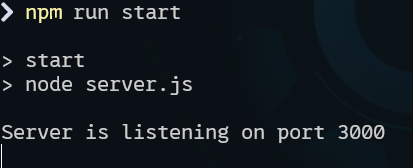
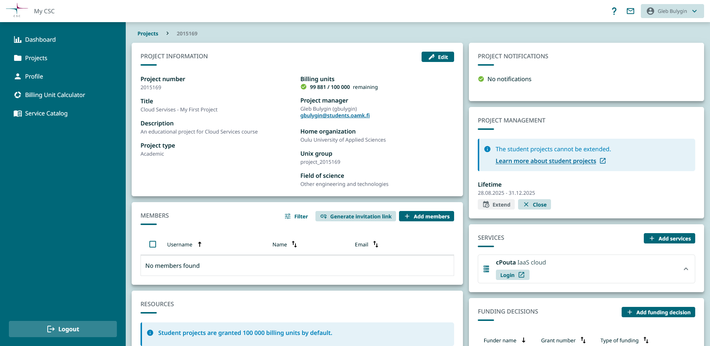

# Learning Diary – Cloud Services

**Student:** Gleb Bulygin
**Group:** DIN24S
**Email:** [gbulygin@students.oamk.fi](gbulygin@students.oamk.fi)

## Week 1 Assignment

I have created a `cloud-services` folder for this project. My folder structure looks like this:

```
cloud-services/
├── week01/
│   ├── demo/
│   │   └─...
│   └── img/
│
├── week02/
│   ├── app.js
│   ├── report.pdf
│   └── img/
│
├── week03/
│   ├── index.html
│   ├── styles.css
│   └── img/
│
├── week-04/
│   └── ...
│
├── learning-diary.md
```

### I chose the following task:

> - Implement your own NodeJS app with [these](https://fly.io/docs/js/) instructions

I created a `package.json` file with the following content:

```json
{
	"scripts": {
		"start": "node server.js"
	}
}
```

<div style="page-break-after: always;"></div>

Then run following commands:

```powershell
# create a demo folder
mkdir demo
# go to the demo folder
cd demo
# Run the latest Fly.io Node.js demo app with npx (auto-confirm install)
npx --yes @flydotio/node-demo@latest
```


**Figure 1.1:** _Result of the commands above_

Then the app can be started with the `npm run start` command from the terminal.



**Figure 1.2:** _App started_

<div style="page-break-after: always;"></div>

The app is running locally on port 3000. To confirm, go to [http://localhost:3000/](http://localhost:3000/).


**Figure 1.3:** _App increments the counter after every page visit or refresh_

---

<div style="page-break-after: always;"></div>

**At this point, I realized that Fly.io would charge me for hosting the app. I did not want to deal with the billing system, so I switched to a different assignment:**

> Or set up a Linux VPS with some cloud VPS provider such as CSC, DigitalOcean, Hetzner, Oracle, Upcloud, AWS, Azure, etc.

During the class, we went through the steps of setting up a virtual machine on [csc.fi](https://csc.fi/en/). I will document the main steps here:

1. Set up a myCSC account. We used authentication with Haka:

     
   **Figure 1.4:** _Login page_

<div style="page-break-after: always;"></div>

2. Create a new project.

3. Add a cPouta service to the project.

     
   **Figure 1.5:** _myCSC project_

4. Log in to [cPouta service](https://pouta.csc.fi/).

5. Create a new instance. I chose Ubuntu 24.04, `standard.medium`, and created a new SSH key pair for it.  
   **Important!** An SSH key can only be added to the instance at the moment of creation. I tried to do it afterward and failed.

     
   **Figure 1.6:** _myCSC project after all settings are applied_

<div style="page-break-after: always;"></div>

6. On the `Network/Floating IPs` tab, create a floating IP and assign it to the instance. This IP address will be used to access the instance.

     
   **Figure 1.7:** _Floating IP_

   > All changes to the instance are applied from the `Actions` button on the right-hand side of the table. For example, to associate a Floating IP, click the dropdown list and select `Associate Floating IP`.

7. On the `Network/Security groups` tab, create a new security group and add the following rules:

   - SSH (default parameters, I left the IP range set to 0.0.0.0/0 – no restrictions for now).
   - Custom TCP rule: port 80 (HTTP).
   - Custom TCP rule: port 443 (HTTPS).

     
   **Figure 1.8:** _Security group settings_

8. Move the private part of the generated earlier SSH key to the `~\.ssh\` folder.

   > Instructions suggested using PuTTY to connect to the virtual machine, but I preferred PowerShell. (I tried PuTTY as well, and it worked.)

9. Under `~\.ssh\`, create a file named `config`.

10. Paste the following content into it:

    ```
    Host cloud69
    HostName 86.50.169.83
    User ubuntu
    IdentityFile ~/.ssh/cloud69
    ```

    - **Host** – local name for the SSH connection
    - **HostName** – floating IP of the virtual machine
    - **User** – default user (`ubuntu`)
    - **IdentityFile** – private part of the SSH key pair generated during VM creation

11. Connect to the virtual machine:

    ```powerShell
    ssh cloud69
    ```

      
    **Figure 1.9:** _Successful connection to the virtual machine_

12. Run the following commands to install and start the Apache2 service:

    ```bash
    sudo apt update
    sudo apt install apache2

    sudo systemctl start apache2
    sudo systemctl enable apache2
    sudo systemctl status apache2
    ```

      
    **Figure 1.10:** _Apache2 status_

13. Open the page in a browser: [http://86.50.169.83/](http://86.50.169.83/)

      
    **Figure 1.11:** _Apache2 default page showing in the browser_

14. With a little help of chat GPT I hve created a dashboard that shows some system Information of my Virtual machine.

    a. Run following commands on virtual machine terminal

    ```bash
       sudo apt update
       sudo apt install -y php libapache2-mod-php
       sudo systemctl restart apache2
    ```

    b. Create the dashboard
    Create and file `/var/www/html/dashboard.php`. The code is too long to include it here. It is posted on my [private repo](https://github.com/gllbhh/cloud-servises) for this course.

    c. Visit [http://86.50.169.83/dashboard.php](http://86.50.169.83/dashboard.php) to check it out.

      
    **Figure 1.12:** _Apache2 default page showing in the browser_

    ***
