# Learning Diary – Cloud Services

**Student:** Gleb Bulygin

**Group:** DIN24S

**Email:** [gbulygin@students.oamk.fi](gbulygin@students.oamk.fi)

## Week 2 Assignment

### Select and answer at least four questions:

> - Explain what is serverless architecture?
> - When it is more feasible solution to use application containers (app virtualization) than full OS virtualization to provide networked services?
> - Compare application containers to microservices
> - Describe shortly what is Kubernetes and what alternatives are there?
> - List some information security risks when using third party (for example Docker) containers?
> - If you would now use a virtualized Windows operating system in your laptop (whatever operating system the laptop already has): Which virtualization platform (VMware, Virtualbox, Hyper-V, KVM, etc…) would you use and why?
> - List requirements and features to be considered when estimating Amazon EC2 instance or Azure virtual machine deployment costs (check the pricing guides)
> - When and why some organisations use (cloud) VDI/DaaS (here DaaS = Desktop as a Service) solutions? List some DaaS providers and offerings/pricing
> - List some benefits of IaC (Infrastructure as Code) for modern software development
> - Write a essay about Twelve-Factor methodology (SaaS)

> I moved this part up in the document for the mandatory part of the documentation to be at the top, so the numbering of images will break

1. _Explain what is serverless architecture?_

   Serverless architecture is a way of building and running application without managing the underlying servers of infrastructure. The name might be somewhat misleading (_there is no cloud, it's just someone else's computer_). In this model all the maintaining, updating and scaling is managed by the cloud provider (like AWS, Azure, Google Cloud or Cloudflare Workers). App is commonly split into parts which communicate with each other. In this approach it is common to use FaaS (function as service) or/and BaaS (backend as a service).

     
   **Figure 2.23:** _Image from https://medium.com/javarevisited/do-you-know-everything-about-serverless-architecture-f0cd06c81329_

2. _When it is more feasible solution to use application containers (app virtualization) than full OS virtualization to provide networked services?_

   **Containers** are lightweight software packages that contain all the dependencies required to execute the contained software application. These dependencies include things like system libraries, external third-party code packages, and other operating system level applications. The dependencies included in a container exist in stack levels that are higher than the operating system.

   ### Pros:

   - **Iteration speed**. Because containers are lightweight and only include high level software, they are very fast to modify and iterate on.
   - **Robust ecosystem.** Most container runtime systems offer a hosted public repository of pre-made containers. These container repositories contain many popular software applications like databases or messaging systems and can be instantly downloaded and executed, saving time for development teams

   ### Cons:

   - **Shared host exploits.** Containers all share the same underlying hardware system below the operating system layer, it is possible that an exploit in one container could break out of the container and affect the shared hardware. Most popular container runtimes have public repositories of pre-built containers. There is a security risk in using one of these public images as they may contain exploits or may be vulnerable to being hijacked by nefarious actors.

   **Virtual machines** are heavy software packages that provide complete emulation of low level hardware devices like CPU, Disk and Networking devices. Virtual machines may also include a complementary software stack to run on the emulated hardware. These hardware and software packages combined produce a fully functional snapshot of a computational system.

   ### Pros:

   - **Full isolation security.** Virtual machines run in isolation as a fully standalone system. This means that virtual machines are immune to any exploits or interference from other virtual machines on a shared host. An individual virtual machine can still be hijacked by an exploit but the exploited virtual machine will be isolated and unable to contaminate any other neighboring virtual machines.
   - **Interactive development.** Containers are usually static definitions of the expected dependencies and configuration needed to run the container. Virtual machines are more dynamic and can be interactively developed. Once the basic hardware definition is specified for a virtual machine the virtual machine can then be treated as a bare bones computer. Software can manually be installed to the virtual machine and the virtual machine can be snapshotted to capture the current configuration state. The virtual machine snapshots can be used to restore the virtual machine to that point in time or spin up additional virtual machines with that configuration.

   ### Cons:

   - **Iteration speed.** Virtual machines are time consuming to build and regenerate because they encompass a full stack system. Any modifications to a virtual machine snapshot can take significant time to regenerate and validate they behave as expected.
   - **Storage size cost.** Virtual machines can take up a lot of storage space. They can quickly grow to several gigabytes in size. This can lead to disk space shortage issues on the virtual machines host machine.

   ### Containers VS Virtual Machines camparison table:

   | Aspect                  | **Containers (App Virtualization)**                               | **VMs (Full OS Virtualization)**                                                 |
   | ----------------------- | ----------------------------------------------------------------- | -------------------------------------------------------------------------------- |
   | **Startup time**        | Seconds (very fast)                                               | Minutes (slower, full OS boot)                                                   |
   | **Resource efficiency** | Lightweight, share host kernel → higher density per host          | Heavier, each VM needs full OS → fewer instances per host                        |
   | **Scalability**         | Scales quickly, ideal for microservices & elastic workloads       | Slower to scale, more suited for stable, long-running workloads                  |
   | **Isolation**           | Process-level isolation, weaker security boundary                 | Strong isolation (separate kernels), better for untrusted/multi-tenant workloads |
   | **OS flexibility**      | Must use same kernel as host (e.g., all Linux)                    | Can run different OSes (Linux + Windows side by side)                            |
   | **Use case fit**        | Web servers, APIs, stateless apps, CI/CD, batch jobs              | Legacy apps, monoliths, databases, apps with strict compliance needs             |
   | **Management**          | Easy packaging & deployment (Docker, Kubernetes)                  | Heavier management (Hyper-V, VMware, KVM)                                        |
   | **Networking**          | Lightweight networking, service meshes (Istio, Linkerd) work well | Traditional network stacks, easier to isolate but heavier overhead               |
   | **Best for**            | Cloud-native apps, microservices, high density, fast iteration    | Legacy systems, strong isolation needs, multi-OS environments                    |

3. _Compare application containers to microservices_

   An application container is a way of packaging and running an application while the microservice is an archictectural style when an application is split into many small pieces which work together. In other words, a container would be a way to run a microservice but you can run microservices in other environments like virtul machine or serverless environment.

4. _Describe shortly what is Kubernetes and what alternatives are there?_

   Kubernetes, also known as K8s, is an open source system for automating deployment, scaling, and management of containerized applications.

   It groups containers that make up an application into logical units for easy management and discovery. Kubernetes builds upon 15 years of experience of running production workloads at Google, combined with best-of-breed ideas and practices from the community.

   Main alternatives:

   - Docker Swarm – simpler, Docker-native orchestrator (less feature-rich than Kubernetes).
   - Apache Mesos / Marathon – general cluster manager with container orchestration support.
   - HashiCorp Nomad – lightweight, flexible scheduler for containers and other workloads.
   - Cloud provider services (managed orchestration):
     - AWS ECS (Elastic Container Service)
     - AWS Fargate (serverless containers)
     - Google Cloud Run
     - Azure Container Instances / Azure Service Fabric

### [AWS tutorial](https://aws.amazon.com/getting-started/hands-on/build-serverless-web-app-lambda-amplify-bedrock-cognito-gen-ai/)

> #### Overview
>
> _In this tutorial, you will learn how to use AWS Amplify to build a serverless web application powered by Generative AI using Amazon Bedrock and the Claude 3 Sonnet foundation model. Users can enter a list of ingredients, and the application will generate delicious recipes based on the input ingredients. The application includes an HTML-based user interface for ingredient submission and a backend web app to request AI-generated recipes._

1. Create an account. I have used my student email and a disposable bank card from Revolut. AWS provides 100$ to use on their platform with the registration.

2.

### Create a VM in [Microsoft Azure](https://portal.azure.com/#home) cloud service

1. Login to [Microsoft Azure](https://portal.azure.com/#home)

2. `optional` Check subscriptions and credit balance

   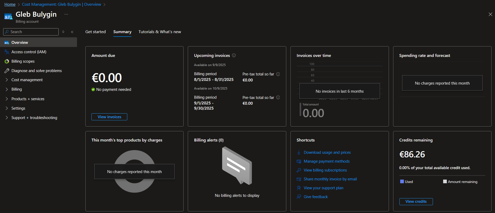  
   **Figure 2.1:** _Credits Remaining_

3. From the left panel select `Create a resource`

     
   **Figure 2.2:** _Create a new resourse_

4. Select a Virtual Machine

   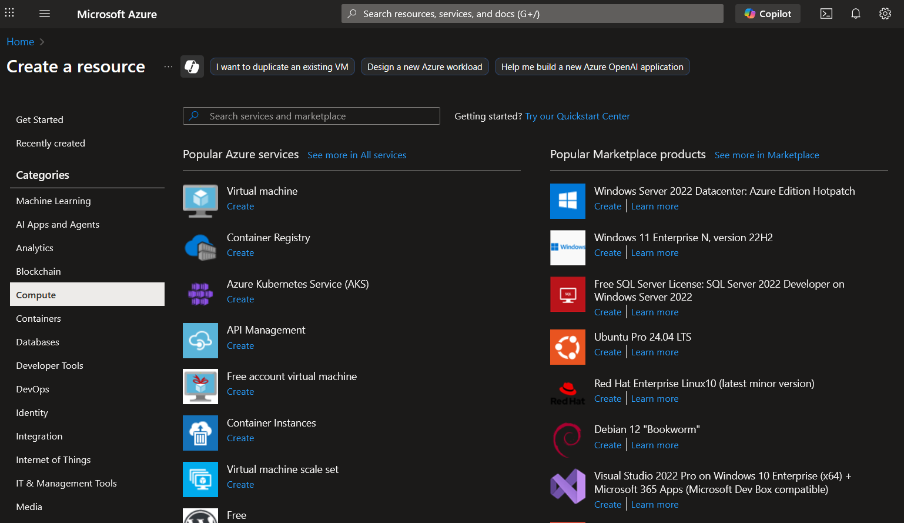  
   **Figure 2.3:** _Create a Virtual Machine_

5. Set up a Virtual Machine

   - Subscription: Azure for Students
   - Resource group: (New) Cloud-Services
   - Image: Ubuntu Server 24.04 LTS
   - Size: Standard_B2ts_v2 (I choose one of the cheapest ones)

   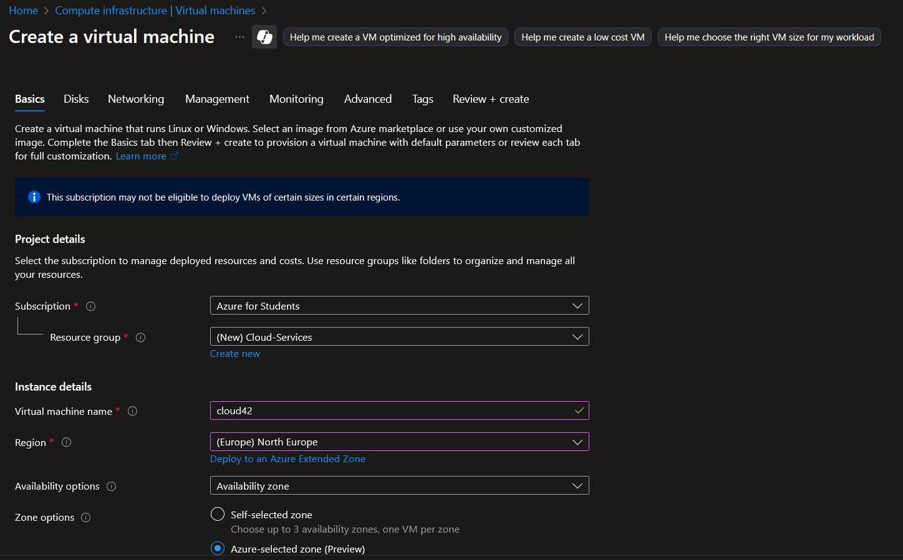  
    **Figure 2.4:** _Set up a Virtual Machine - 1_

   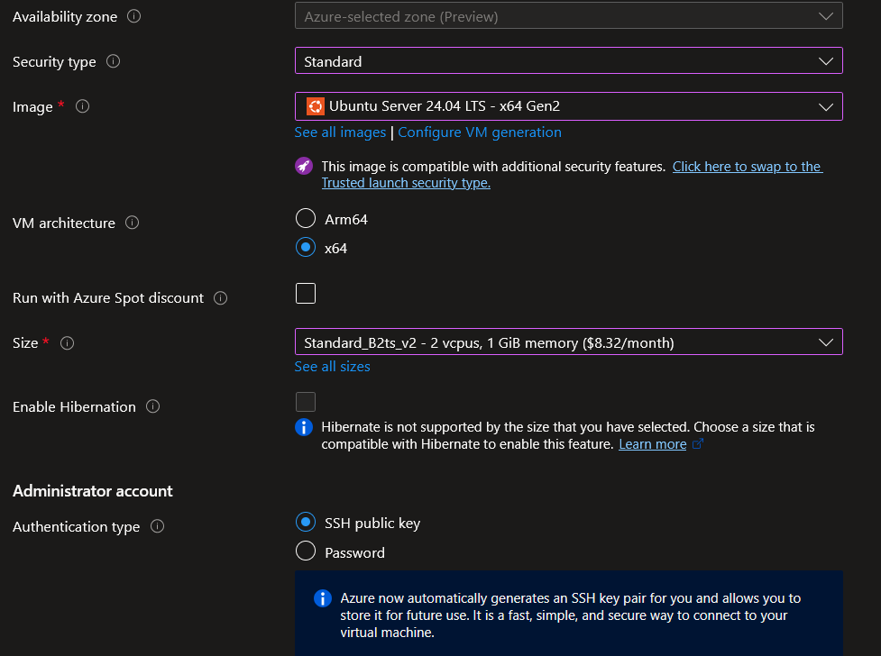  
    **Figure 2.5:** _Set up a Virtual Machine - 2_

   I have used an existing SSH key pair. I pasted the public key to the corresponding field here.

   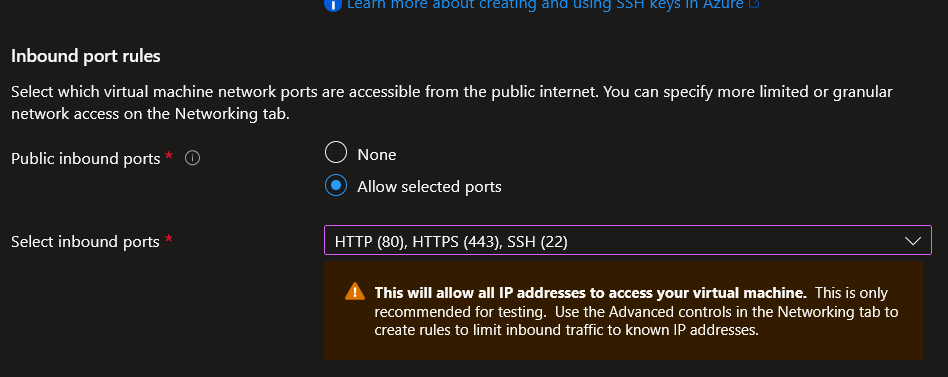  
    **Figure 2.6:** _Set up a Virtual Machine - 3_

   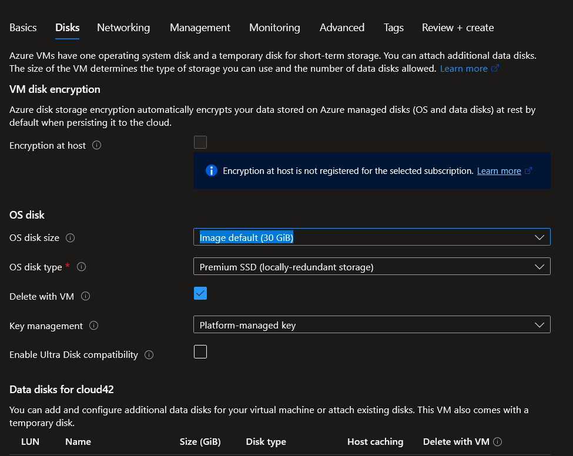  
    **Figure 2.7:** _Set up Disks_

   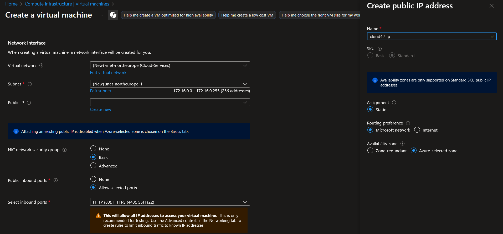  
    **Figure 2.8:** _Network settings_

   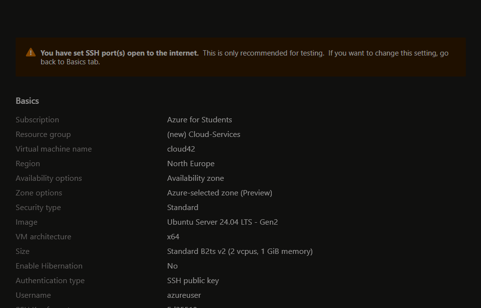  
    **Figure 2.9:** _Virtual machine summary_

   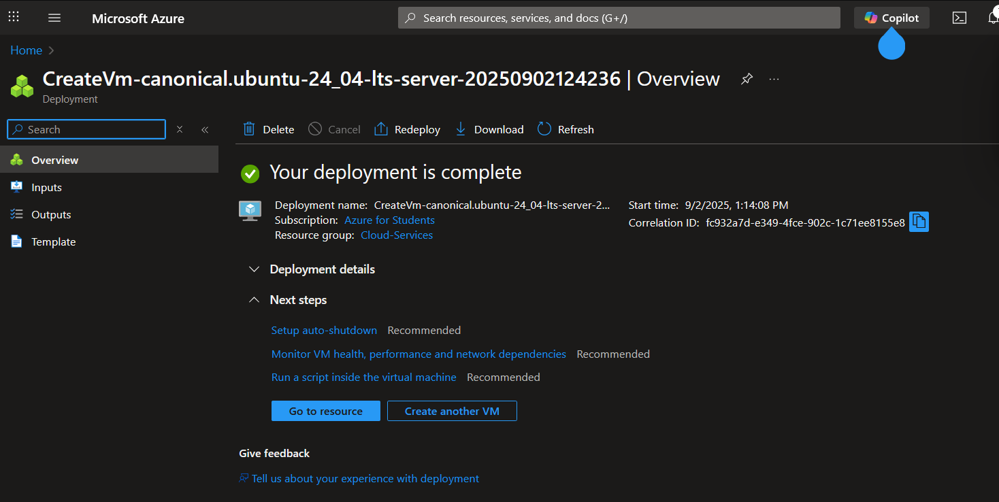  
    **Figure 2.10:** _Successful deployment_

   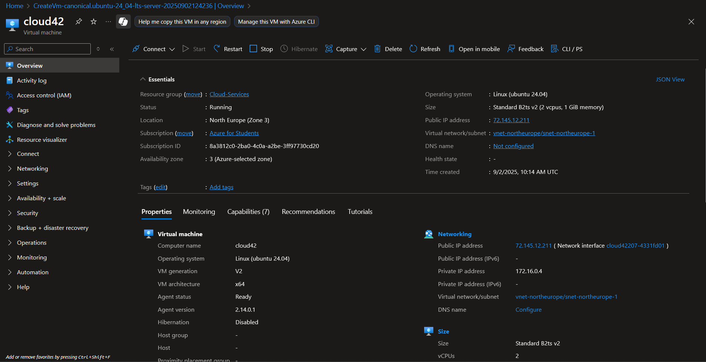  
    **Figure 2.11:** _Virtual machine overview_

6. I use PowerShell to connect to my virtual machine. My private SSH key is located in my `~/.ssh/folder`. Now I can connect to my virtual machine with:

   ```powerShell
    ssh azureuser@72.145.12.211
   ```

7. Next install apache2 by running following commands:

   ```bash
   sudo apt update
   sudo apt install apache2
   sudo systemctl start apache2
   sudo systemctl enable apache2
   sudo systemctl status apache2
   ```

     
    **Figure 2.12:** _apache2 up and running_

   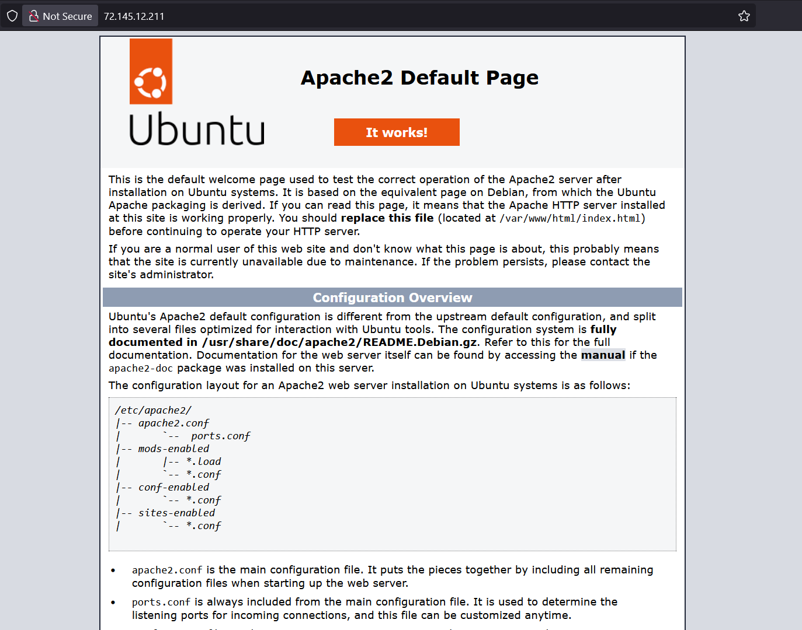  
    **Figure 2.13:** _apache2 default page_

8. I used the same dashboard that I have created during week 1.

   ```bash
   sudo apt install -y php libapache2-mod-php
   sudo systemctl restart apache2
   sudo touch /var/www/html/dashboard.php
   sudo nano /var/www/html/dashboard.php
   # then I pasted the contents of my dashboard.php file and saved it. Dashboard should be runnig after that.
   ```

   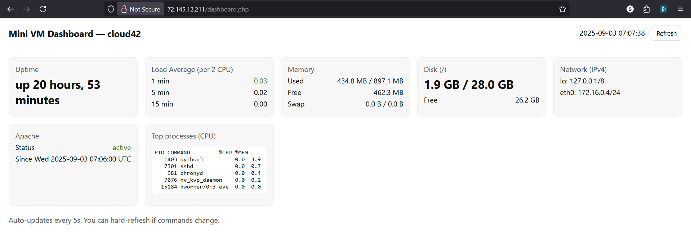  
    **Figure 2.14:** _My Dashboard Running_

### Create a Docker container

> **Why to use a container?** I takes less computing power than a Virtual Machine, so if only a simple application is needed it is easier to use a container. It is also easy to create, set-up and move containers.

> I followed [these](https://moodle.oulu.fi/mod/resource/view.php?id=1900844) instructions

1.  Download and install [Docker Desktop](https://www.docker.com/products/docker-desktop/)
2.  Login using github
3.  Create a folder `myapp`
4.  Create `app.py` with following content:

    ```
    from flask import Flask

    app = Flask(__name__)

    @app.route('/')
    def hello():
       return "Hello, Azure!"

    if __name__ == '__main__':
    app.run(host='0.0.0.0', port=80)
    ```

5.  In the same folder create `Dockerfile` with following content:

    ```
    # Python 3.9
    FROM python:3.9-slim

    # Working folder in container
    WORKDIR /app

    # copy app files into container
    COPY . /app

    # install dependencies
    RUN pip install flask

    # open the port 80
    EXPOSE 80

    # define command to be executed in container
    CMD ["python", "app.py"]
    ```

6.  Open Terminal and navigate to the folder `myapp'

7.  `With running Docker desktop` run:

    ```
    # build the Docker container
    docker build -t myflaskapp .

    # run the docker container
    docker run -p 8080:80 myflaskapp
    ```

    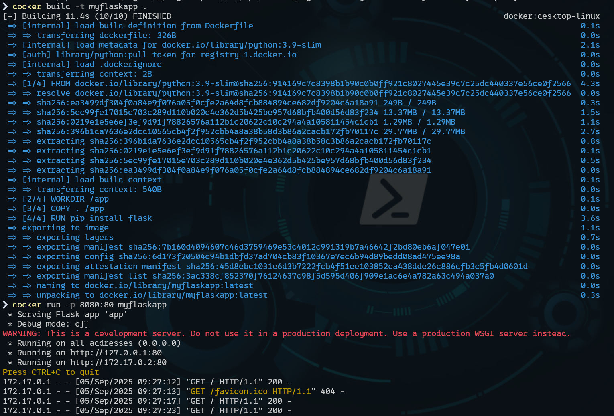  
     **Figure 2.15:** _Docker: build and run_

    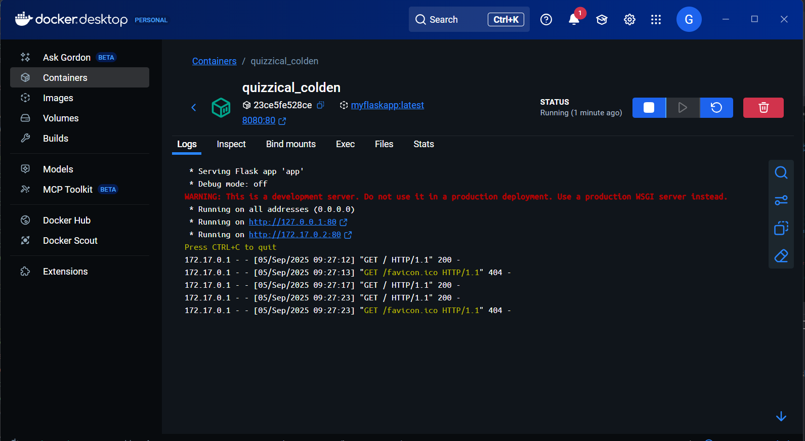  
     **Figure 2.16:** _Container in Docker Desktop UI_

8.  Open http://localhost:8080

    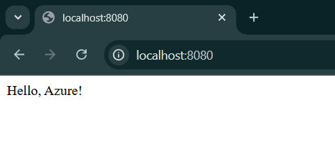  
     **Figure 2.17:** _App running_

9.  Install (if not already) Azure CLI

    ```
    winget install --exact --id Microsoft.AzureCLI
    ```

    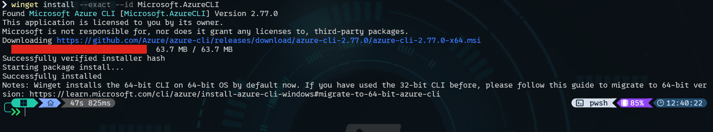  
     **Figure 2.18:** _Azure CLI installation_

10. Reopen the active terminal window and run following commands:

    ```
    az login
    ```

    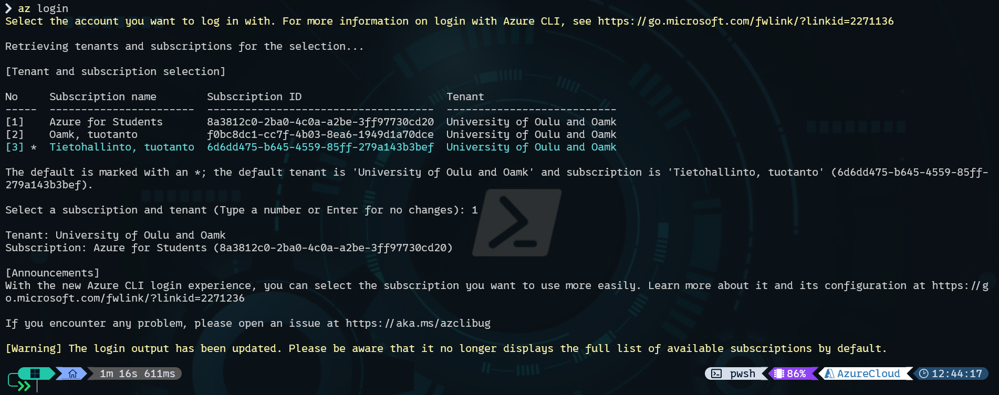
    **Figure 2.19:** _Azure CLI after successful login_

    I already have a resource group `Cloud-Services` created on previous step. So I skipped creating a new one (trying to troubleshoot what is happening I created a new group `meResourceGroup` afterwards).

    ```
    az acr create --resource-group myResourceGroup --name myContainerRegistry --sku Basic
    ```

    **After this I encountered many errors troubleshooting it one at a time.**

    ```
    az acr create --resource-group myResourceGroup --name myContainerRegistry --sku Basic
    ```

    At this point I hit what chatGPT called a _classic Azure “resource provider not registered” error._ Also, no CAPS or dashes are allowed in the container registry.

    Suggestion from chatGPT that worked:

    ```
    # 1) Make sure you're on the right subscription
    az account show
    # (optional) switch if needed
    az account set --subscription "<SUBSCRIPTION_NAME_OR_ID>"

    # 2) Register the ACR resource provider
    az provider register --namespace Microsoft.ContainerRegistry

    # 3) Wait a bit, then verify state becomes "Registered"
    az provider show -n Microsoft.ContainerRegistry --query "registrationState" -o tsv

    ```

    Then instruction suggeset running following commands:

    ```
    # Create ACR - ✅
    az acr create --resource-group myResourceGroup --name myContainerRegistry --sku Basic

    # Login into ACR - ✅
    az acr login --name myContainerRegistry

    # Tag your docker image - ✅
    docker tag myflaskapp myContainerRegistry.azurecr.io/myflaskapp:v1

    # Push into ACR: - ✅
    docker push myContainerRegistry.azurecr.io/myflaskapp:v1

    # Create Container Instance using your Docker-image ❌
    az container create --resource-group myresourcegroup --name myflaskappcontainer --image mycontainerregistry.azurecr.io/myflaskapp:v1 --cpu 1 --memory 1 --registry-login-server mycontainerregistry.azurecr.io --registry-username <acr-username> --registry-password <acr-password> --dns-name-label myflaskappdemo --ports 80
    ```

    Last step was giving me all sorts of errors.

    Starting with:

    ```
    az acr credential show --name mycontainerregistry
    # ❌ worked only after following command:

    az acr update -n gllbhhcontainer --admin-enabled true
    ```

    It filnally worked! My container registery is called `cloud42container` in resource group `Cloud-services`. Also it is missing from the instructions, but apparently it is important to change, is the --dns-name-label. It should be something unique. in my case it was `myflaskdemo069420069.`

    **Final verion of the command that worked**

    ```
    az container create --resource-group Cloud-Services --name cloud42container --image cloud42container.azurecr.io/myflaskapp:v1 --location northeurope --cpu 1 --memory 1 --os-type Linux --ip-address Public --ports 80 --dns-name-label myflaskdemo069420069 --registry-login-server cloud42container.azurecr.io --registry-username cloud42container --registry-password "<myPassword>"
    ```

    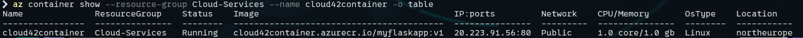
    **Figure 2.20:** _Container is working!_

    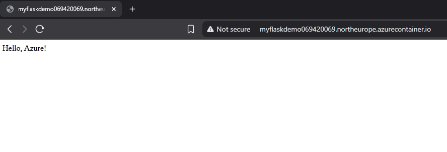
    **Figure 2.21:** _App is availabe on [http://myflaskdemo069420069.northeurope.azurecontainer.io/](http://myflaskdemo069420069.northeurope.azurecontainer.io/)_

    ### From here to update the container:

    ```
    # from inside your project folder
    docker build -t myflaskapp:v2 .

    docker tag myflaskapp:v2 cloud42container.azurecr.io/myflaskapp:v2

    az acr login -n cloud42container

    docker push cloud42container.azurecr.io/myflaskapp:v2

    # Change the image version!
    az container create --resource-group Cloud-Services --name
    cloud42container --image cloud42container.azurecr.io/myflaskapp:v2 --location northeurope --cpu 1 --memory 1 --os-type Linux --ip-address Public --ports 80 --dns-name-label myflaskdemo069420069 --registry-login-server cloud42container.azurecr.io --registry-username cloud42container --registry-password "<yourPassword>" --restart-policy Always
    ```

    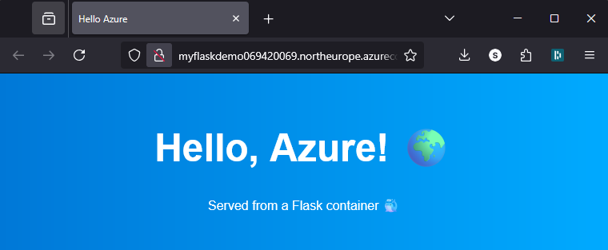
    **Figure 2.22:** _Udpated app with some HTML is availabe on [http://myflaskdemo069420069.northeurope.azurecontainer.io/](http://myflaskdemo069420069.northeurope.azurecontainer.io/)_
