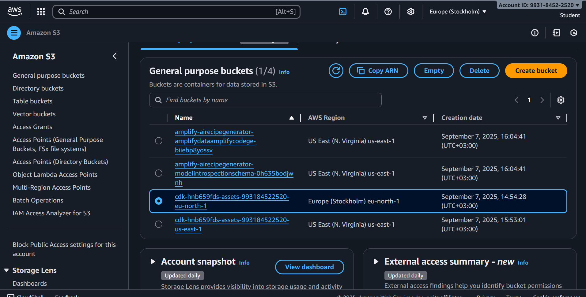
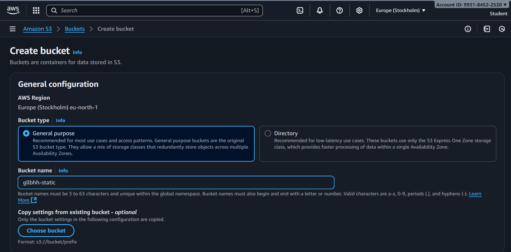
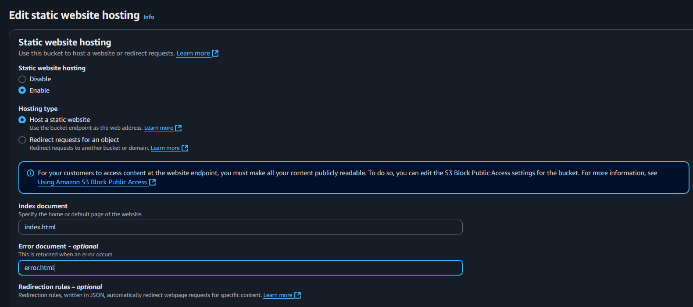
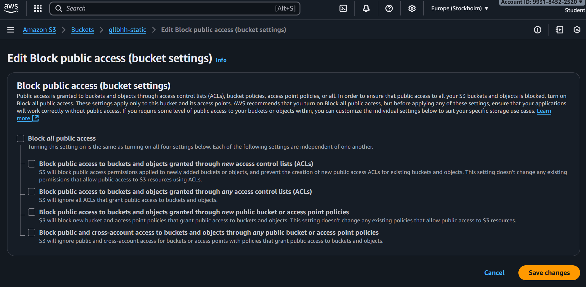
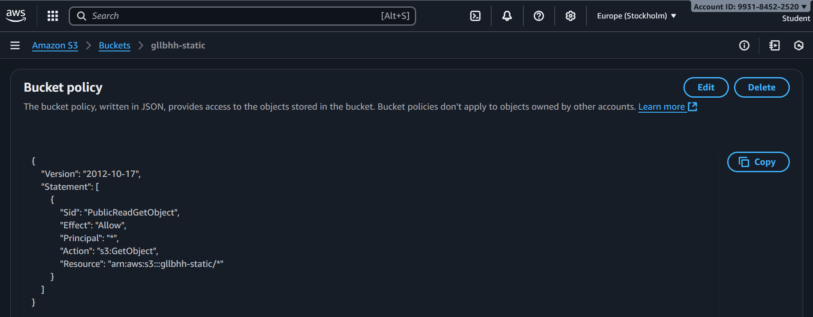
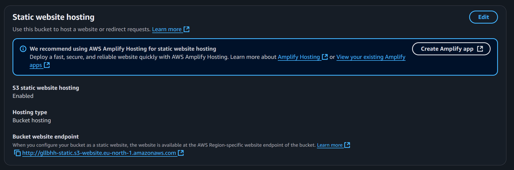
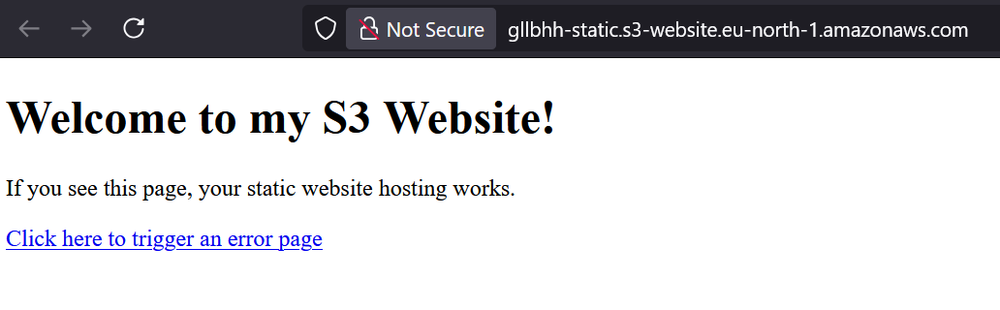
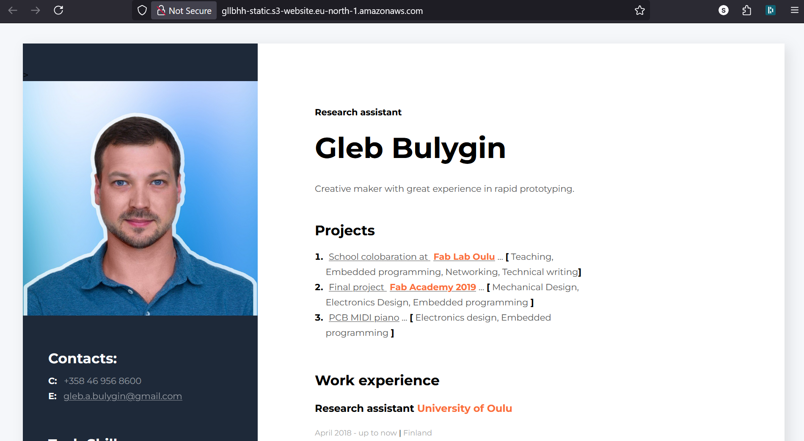

# Learning Diary – Cloud Services

**Student:** Gleb Bulygin
**Group:** DIN24S
**Email:** [gbulygin@students.oamk.fi](gbulygin@students.oamk.fi)

## Week 3 Assignment

> ### _This week I took down all the resources create during two previous weeks._

### Select and answer at least four questions:

> - Describe reasons why so many (most?) companies are using cloud based email and calendar services
> - What would a mid-size company store to the Amazon Glacier? What not? Why? What other large cloud backup or mass storage providers are there?
> - Select and describe 2-3 well-known Amazon S3 data leak incidents. What went wrong? List some automated S3 bucket search engines and attack tools (don't try the tools, illegal!)
> - Compare few cloud data storage provider features and pricing (either for home users or for enterprises)
> - Compare some large web hosting / web hotel provider offerings (not CDN)
> - Your thoughts about when to maintain your own web server and when to use SaaS/PaaS/IaaS to provide web services?
> - List and explain some pros and cons (for example CDN challenges) of public DNS resolvers (Google's 8.8.8.8, Cloudflare's 1.1.1.1 etc.) vs common home networking, where end users are using ISP's DNS resolvers
> - Describe reasons, why many IoT devices (internet connected home appliances, Smart-TVs and such) are using Google's 8.8.8.8 or some other public DNS resolvers?
> - Estimate fees to distribute some static web contents across the world with a large CDN provider (For example: AWS Amplify, Cloudflare, Akamai, etc.):
>   - Monthly traffic is 5 TB / month, distributed quite evenly
>   - Global coverange
>   - How much would it cost to offer same content with multiple VPSs located in Amazon AWS or Azure datacenters?

<div style="page-break-after: always;"></div>

#### 1. Describe reasons why so many (most?) companies are using cloud based email and calendar services.

There are many different cloud based email and calendar servises:

- Microsoft 365
- Google Workspace
- Apple iCloud Mail
- Zoho mail
- Proton mail
- Yandex
- etc.

Yet Microsoft 365 and Google Workspace are dominating the enterprise market.

Main reasons why companies prefer cloud based email providers:

- Cost savings andpredictability:
  - no need to buy and maintain infrastructure and backup systems
  - Cloud services provide transparent subscription system (per-user per-month) making it easy to predict the total cost and scale according to workforce size
- Cloud infrastructure is reliable and generally has great uptime (often 99.99%+)
- Big companies can invest a lot into security, spam filtering, and regulatory networks
- Accessibility and mobility:
  - Employees can securely access email and calendars from anywhere, on any device.
  - Built-in mobile apps and web interfaces make remote and hybrid work easier.
- Scalability and flexibility
  - Adding or removing users is quick and requires no hardware changes.
  - Cloud services can handle large spikes in usage without performance issues.
- Integration and collaboration
  - Email and calendar services are tightly integrated with other productivity tools (chat, video conferencing, file storage, project management).
  - Shared calendars, meeting scheduling, and real-time updates make teamwork smoother.
- Company IT staff no longer have to maintain patches, upgrades and atni-spam solutions for on-premises servers

---

#### 2. Select and describe 2-3 well-known Amazon S3 data leak incidents. What went wrong? List some automated S3 bucket search engines and attack tools (don't try the tools, illegal!)

##### 2021 – Twitch Data Leak

In October 2021, Twitch, an Amazon-owned streaming platform, suffered a massive data leak exposing 125GB of sensitive information. The breach resulted from a server misconfiguration, which allowed public access to internal systems. Data exposed included source code for the Twitch platform, details of creator payouts, and proprietary internal tools.

##### 2022 – Pegasus Data Breach

In May 2022, Pegasus Airlines suffered a data breach due to a misconfigured AWS S3 bucket. The breach exposed 6.5 terabytes of sensitive data, which included flight crew members’ personal information and operational details. Because the bucket was publicly accessible, attackers were able to download confidential files. This incident infers three AWS data protection needs: server-side encryption for S3 buckets, strict bucket policies to prevent public access, and AWS Config implementation to detect and fix misconfigurations in real time.

##### 2025 – Codefinger Ransomware

In January 2025, a ransomware group known as Codefinger targeted AWS users by exploiting compromised AWS credentials. The attackers utilized AWS’s server-side encryption with customer-provided keys (SSE-C) to encrypt data stored in Amazon S3 buckets. By generating and supplying their own AES-256 encryption keys, which AWS does not retain, the attackers made it impossible for victims to decrypt their data without the attackers’ keys. Additionally, the attackers set lifecycle policies to delete the encrypted files within seven days, pressuring victims to pay the ransom promptly.

_\* Information from [https://www.blackfog.com/aws-data-breach/](https://www.blackfog.com/aws-data-breach/)_

##### Automated S3 Bucket Search Engines & Attack Tools:

- Grayhat Warfare (search engine for open S3 buckets and files).
- BuckHacker (defunct, but once used to search public buckets by name).
- AWSBucketDump (Python tool that brute-forces bucket names and checks permissions).
- Slurp (recon tool to discover S3 buckets).
- S3Scanner (finds open S3 buckets and lists contents if public).
- LazyS3 (automation for guessing bucket names from keywords).

---

#### 3. Your thoughts about when to maintain your own web server and when to use SaaS/PaaS/IaaS to provide web services?

Self-hosting offers maximum control but comes with own responsibility over updates, security, uptime etc. Some applications, like medical or criminal applications might demand a higher privacy rate. So in that case hosting on own hardware might be an only option. I have a friend who moved to Luxembourg to work for INTERPOL financial crime unit and his job is to train and implement fully isolated LLM for the service - that would be a good example when own hardware is required.

On the contrary using a cloud based mail server seems more secure to me. Large corporations can invest much more time into security, spam filers etc. providing a better service.

At this point it is hard for me to estimate the actual cost of hosting an application on cloud platform in relation to financial gain from it (at this point I am familiar with pricing of some of the services but I have no idea how much one could get from a hosted application).

I have a personal server that I use mostly as a personal file storage. But if needed I could host a small web application or a WEB site on it.

---

#### 4. List and explain some pros and cons (for example CDN challenges) of public DNS resolvers (Google's 8.8.8.8, Cloudflare's 1.1.1.1 etc.) vs common home networking, where end users are using ISP's DNS resolvers

> A DNS resolver is a server that takes a domain name (like example.com) and returns its corresponding IP address so a computer can connect to it. It acts as an intermediary between your device and the global DNS system, performing lookups and caching results to speed up future queries. In practice, DNS resolvers are usually provided by your ISP or public services like Google (8.8.8.8) or Cloudflare (1.1.1.1).

> An ISP DNS resolver is the default DNS server operated by your Internet Service Provider (ISP). When you connect to the internet and type a domain name, your requests are usually sent to the ISP’s resolver, which translates the name into an IP address. These resolvers are often optimized for local networks and CDN routing, but they may also apply filtering, logging, or even DNS hijacking depending on the ISP’s policies.

#### Public DNS resolvers:

- **Google (8.8.8.8)**
- **Cloudflare (1.1.1.1)**

#### Pros:

- **Performance / reliability**  
  Often faster and more reliable than small or poorly maintained ISP DNS.  
  Global anycast networks ensure low latency.

- **Security features**  
  Cloudflare & Quad9 block malicious domains (phishing, malware).  
  DNS over HTTPS (DoH) or DNS over TLS (DoT) support for privacy.

- **Neutrality**  
  Usually no DNS hijacking, filtering, or ads (some ISPs inject search/ads into NXDOMAIN).

- **Consistency**  
  Same DNS results no matter where you connect from (useful when traveling).

#### Cons

- **CDN geo-optimization issues**  
  Content Delivery Networks (CDNs) often serve content based on **resolver location**, not the end-user’s.  
  Example: if you’re in Finland using 8.8.8.8, you may get routed to a server in Germany instead of Helsinki, leading to slower performance.

- **Privacy trade-offs**  
  Google or Cloudflare see your DNS queries, which can reveal browsing habits.  
  “Privacy-friendly” claims exist, but it requires trust in the provider.

- **Potential blocking**  
  Some services or networks block public DNS resolvers to force use of ISP/local DNS (common in hotels, enterprises).

---

#### ISP DNS Resolvers

#### Pros

- **Better CDN routing**  
  ISPs usually peer with local CDNs, so using their resolver ensures you get content from the closest cache.  
  This often means faster video streaming or downloads.

- **Integrated with ISP infrastructure**  
  May support internal services (captive portals, IPTV, VoIP).  
  Easier troubleshooting for ISP support if you stick with their DNS.

- **Less obvious privacy concern**  
  Your ISP already sees your traffic, so DNS logs don’t add much beyond what they already know.

#### Cons

- **Reliability issues**  
  Smaller ISPs may run outdated, overloaded, or insecure DNS resolvers.  
  Outages can take down internet access for customers.

- **DNS hijacking / filtering**  
  Some ISPs inject ads, redirect “not found” pages, or censor sites.  
  This breaks standards and can cause application errors.

- **Lack of security features**  
  Many ISP resolvers don’t support DNSSEC validation, DoH, or DoT.  
  Less proactive about blocking known malicious domains.

---

#### Summury:

- **Public resolvers** = faster, more secure, and neutral — but can cause **CDN misrouting** and involve **trusting a global provider** with your data.
- **ISP resolvers** = better for **local performance (CDNs, caching)** and compatibility with ISP services, but may be less reliable, less private, and sometimes monetized.

---

<div style="page-break-after: always;"></div>

### AWS S3 web server assignment

[Hosting a static website using Amazon S3](https://docs.aws.amazon.com/AmazonS3/latest/userguide/WebsiteHosting.html?p=gsrc&c=ho_hsw)

I alredy have a AWS acocunt created during Week 2 assignment.

> #### What is Amazon S3?
>
> Amazon Simple Storage Service (Amazon S3) is an object storage service offering industry-leading scalability, data availability, security, and performance. Millions of customers of all sizes and industries store, manage, analyze, and protect any amount of data for virtually any use case, such as data lakes, cloud-native applications, and mobile apps. With cost-effective storage classes and easy-to-use management features, you can optimize costs, organize and analyze data, and configure fine-tuned access controls to meet specific business and compliance requirements.

Login to [AWS S3 console](https://eu-north-1.console.aws.amazon.com/s3/home?region=eu-north-1).

  
 **Figure 3.1:** _AWS S3 console_

There are some buckets created during week 2. I deleted them all (which required to emply and delete each of them separetly).

  
 **Figure 3.2:** _Creating a new general purpose bucket_

In the bucket settings on `Properties` tab enable Static Website hosting.

  
 **Figure 3.3:** _Enable Static Website hosting_

I quickly drafted a very simple index.html and error.html files and uploaded them through the web interface to my bucket.

#### index.html

```html
<!DOCTYPE html>
<html lang="en">
	<head>
		<meta charset="UTF-8" />
		<title>Error - Page Not Found</title>
	</head>
	<body>
		<h1>Oops! Something went wrong.</h1>
		<p>The page you’re looking for doesn’t exist.</p>
		<p><a href="index.html">Go back to the homepage</a></p>
	</body>
</html>
```

#### error.html

```html
<!DOCTYPE html>
<html lang="en">
	<head>
		<meta charset="UTF-8" />
		<title>Error - Page Not Found</title>
	</head>
	<body>
		<h1>Oops! Something went wrong.</h1>
		<p>The page you’re looking for doesn’t exist.</p>
		<p><a href="index.html">Go back to the homepage</a></p>
	</body>
</html>
```

To make the Website visible to the internet change the

  
**Figure 3.4:** _Unmark everything here_

And add following to the bucket policy. In the `Resource` section, replace example name with youtr bucket name.

```
{
"Version": "2012-10-17",
  "Statement": [
    {
      "Sid": "PublicReadGetObject",
      "Effect": "Allow",
      "Principal": "*",
      "Action": [
        "s3:GetObject"
      ],
      "Resource": [
        "arn:aws:s3:::Bucket-Name/*"
      ]
    }
  ]
}
```

  
**Figure 3.5:** _Bucket policy set_

Now the website should be visible. The entry point can be foun on the bottom of the bucket `Propertis` section.

  
**Figure 3.6:** _Bucket entry point_

  
**Figure 3.7:** _[My Bucket](http://gllbhh-static.s3-website.eu-north-1.amazonaws.com/) is online_

Here I remembered that a long time ago I have made myself a one-pager CV. So I quickly removed previous index.html and uploaded resourses for my CV page. The bucket itself does not have a regular file structure. But it is still possible to upload a folder there. So I have following structure there:

```
gllbhh-static
|
├─ index.html
|
├── img/
|   └── profile.jpg
|
└── css
    └── styles.css

```

  
**Figure 3.8:** _[My Bucket](http://gllbhh-static.s3-website.eu-north-1.amazonaws.com/) Updated with my CV page (porbably I need to update it and host it permanently somewhere)_

To enable HTTPS connection the hosting method should be different. The tutorial suggests [AWS Amplify Hosting](https://docs.aws.amazon.com/amplify/latest/userguide/welcome.html.html) or[Amazon Cloud Front](https://aws.amazon.com/premiumsupport/knowledge-center/cloudfront-https-requests-s3).

Since I will take this page down in a week or so, I do not really care to go through the whole process.
