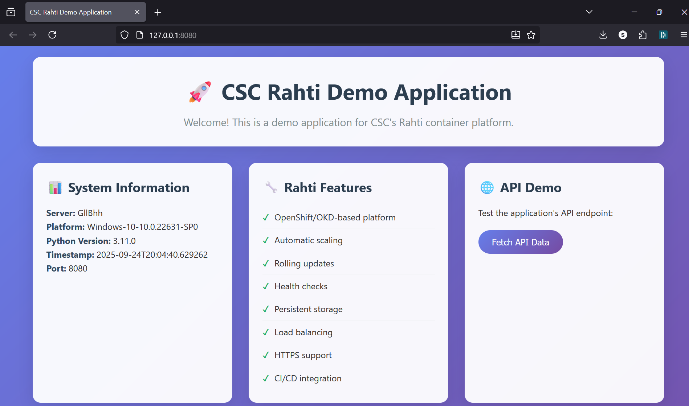
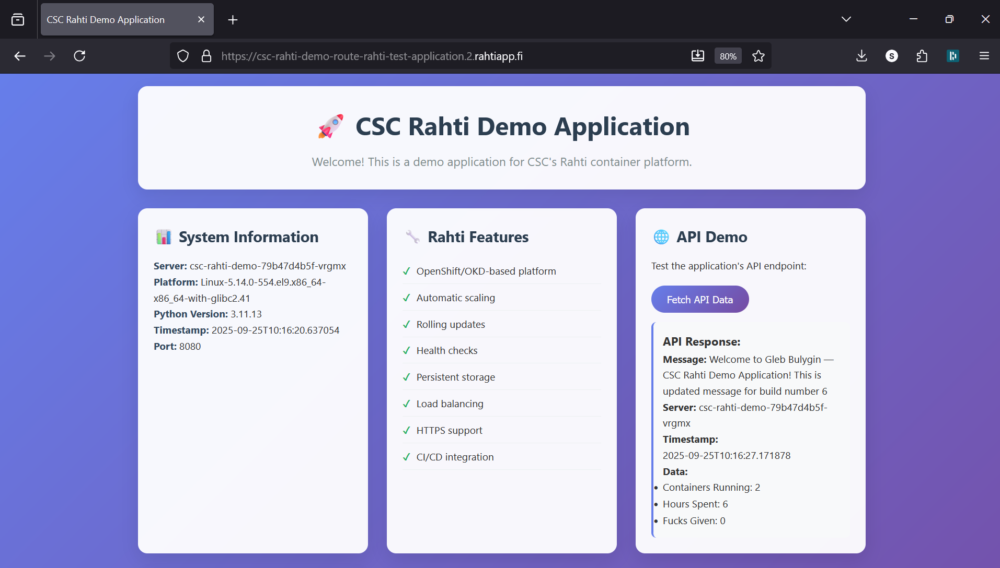

# Learning Diary – Cloud Services

**Student:** Gleb Bulygin

**Group:** DIN24S

**Email:** [gbulygin@students.oamk.fi](gbulygin@students.oamk.fi)

## Week 4 Assignment

> [link to my Rahti application](https://csc-rahti-demo-route-rahti-test-application.2.rahtiapp.fi/)

---

I started with [this](https://github.com/Vikke82/csc-rahti-demo/) repository readme instructions.

First I got the `openshift-client-windows.zip` file from [https://mirror.openshift.com/pub/openshift-v4/clients/ocp/stable/](https://mirror.openshift.com/pub/openshift-v4/clients/ocp/stable/) since the winget command did not work for me. I already have a python and git installed. I have a `util/` folder in the roor of drive `C:/`. It is added to path variable, so I added `os.exe` file to that folder.

I forked the repo and cloned the fork locally. I added the original repo as an upstream repo for updates.


**Figure 4.1:** _Local repo with set upstream_

Then from the project folder (worked from admin terminal)

```
pip install -r requirements.txt
python app.py
```


**Figure 4.2:** _App running locally on http://127.0.0.1:8080_



**Figure 4.3:** _App running locally on http://127.0.0.1:8080_

Then I added Rahti to myCSC project `Cloud Services - My first project` from web console.

```
# All commands I ran in powerShell terminal inside scs-rahti-demo folder
# Login to CSC Rahti
oc login https://api.2.rahti.csc.fi:6443

#For me login worked only with command below. It allowed to login via browser.
oc login --web https://api.2.rahti.csc.fi:6443

# Create your project (use your CSC project number)
oc new-project my-student-project --description="csc_project: YOUR_NUMBER"

# Worked fine with different project name. CSC project number can be found from myCSC page.


# Deploy the application
chmod +x deploy.sh  # Linux/macOS
./deploy.sh deploy

# Windows users:
# deploy.bat deploy

# deployment worked with
.\deploy.bat deploy
```


**Figure 4.4:** _Rahti Container Deployed_


**Figure 4.5:** _`.\deploy.bat status` command output_


**Figure 4.6:** _App is not available_

After some troubleshooting I figured the **problem**: _Pods were stuck in ImagePullBackOff._

In my event log I had:

`Failed to pull image ".../my-demo-project/csc-rahti-demo:latest": authentication required`

It seems that the Deployment in my `rahti-test-application` was trying to pull an image from the internal registry in a different project (`my-demo-project`). The service account in rahti-test-application didn’t have permission to pull `from my-demo-project`, so the registry returned **auth required**.

I tryied to fix the issue by importing the image once again but OpenShift gave me a warning that the `latest` tag already existed and pointed somewhere else; I needed to retarget the tag with `oc tag` instead of `oc import-image`.

Do I retagged the image into my own project’s ImageStream (csc-rahti-demo:latest in rahti-test-application) and pointed the Deployment at that tag. Now the image is pulled within the same namespace, avoiding cross-namespace auth, and the pods run.


**Figure 4.7:** _My fix of 'failed to pull image' error_

Commands I used:

```
# to make sure I am in the correct project
oc project rahti-test-application

# attempt to import the image again. Should have skipped this one
oc import-image csc-rahti-demo:latest --from=image-registry.openshift-image-registry.svc:5000/my-demo-project/csc-rahti-demo:latest --confirm

# tag the image
oc tag image-registry.openshift-image-registry.svc:5000/my-demo-project/csc-rahti-demo:latest csc-rahti-demo:latest -n rahti-test-application

# Make Deployments resolve ImageStream names automatically
oc -n rahti-test-application set image-lookup csc-rahti-demo

# Point your Deployment to use the ImageStream tag in THIS namespace
oc set image deploy/csc-rahti-demo csc-rahti-demo=csc-rahti-demo:latest

# Roll out
oc rollout restart deploy/csc-rahti-demo
oc rollout status deploy/csc-rahti-demo

# check status
.\deploy.bat status
```


**Figure 4.8:** _Pods running_

Here I am not completely sure if I am supposed to have two pods running. But they do =)


**Figure 4.9:** _Pods running_

Then I edited `app.py` to give different output on the `API Demo` tab (`@app.rout('/api/data')` section).

To update the App

```
# Rebuild and deploy updated application
oc start-build csc-rahti-demo --from-dir=. --follow

# Or use the deploy script
.\deploy.bat deploy
```

Aaaaand it broke again. It has `ImagePullBackOff` status when I run `oc -n rahti-test-application get pods` command.

The problem was that I still was pulling from image registery instead of my local copy of the project. Attempt to fix it again.

```
# 1) Resolve ImageStream names inside your namespace (nice shorthand)
oc -n rahti-test-application set image-lookup csc-rahti-demo

# 2) Point the deployment at your local ImageStream tag
oc -n rahti-test-application set image deploy/csc-rahti-demo \
  csc-rahti-demo=csc-rahti-demo:latest

# 3) Enable image-change trigger so new images redeploy automatically
oc -n rahti-test-application set triggers deploy/csc-rahti-demo --remove-all
oc -n rahti-test-application set triggers deploy/csc-rahti-demo \
  --from-image=csc-rahti-demo:latest -c csc-rahti-demo

# 4) Roll out
oc -n rahti-test-application rollout restart deploy/csc-rahti-demo
oc -n rahti-test-application rollout status deploy/csc-rahti-demo
```

Now I can see my updated app.


**Figure 4.10:** _API Demo with updated demo_

Now to I will update the app again to test if everything still works. After building the new image the app should update be deployed automatically.

```
oc -n rahti-test-application start-build csc-rahti-demo --from-dir=. --follow
```



**Figure 4.11:** _App successfully updates after building the app locally_
