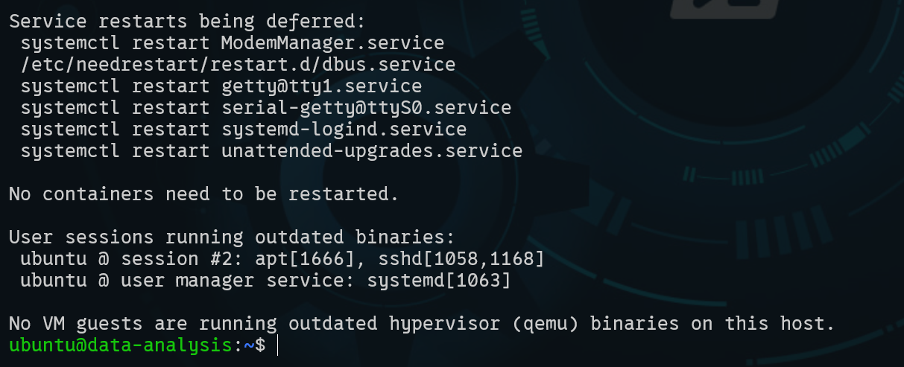
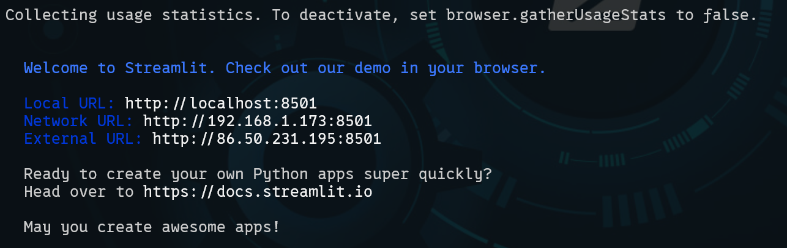
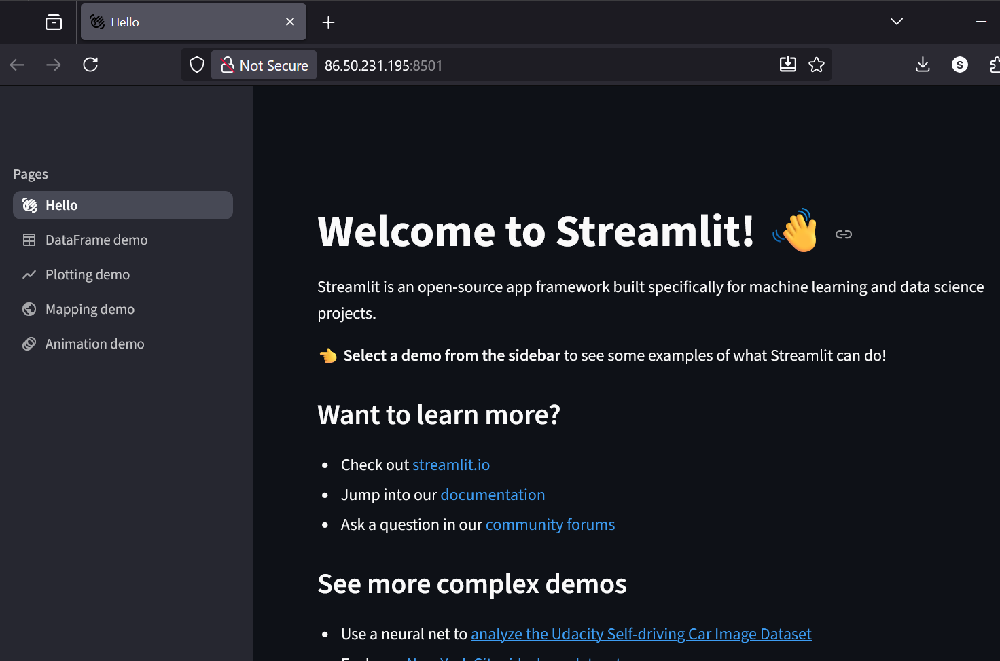
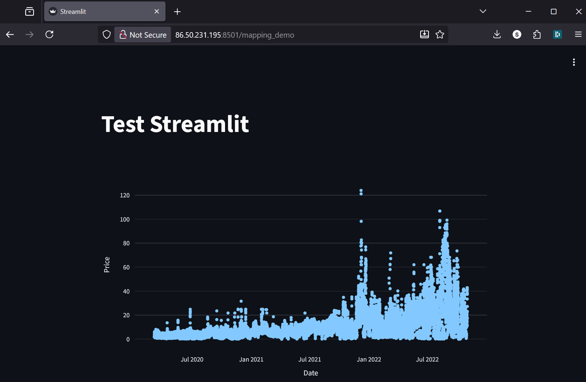
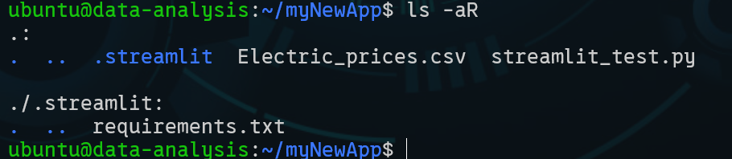
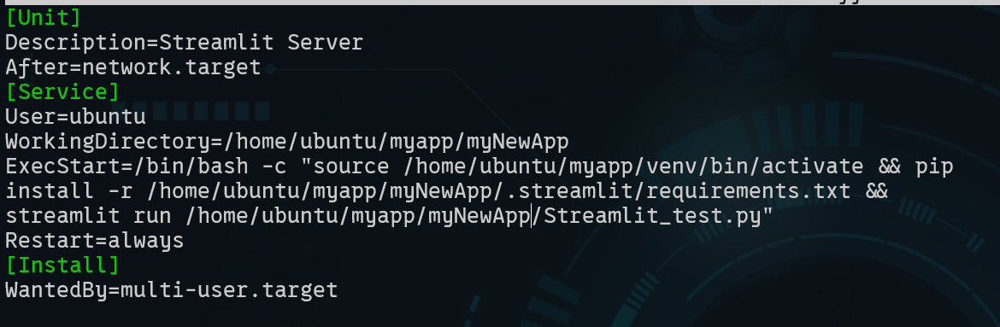
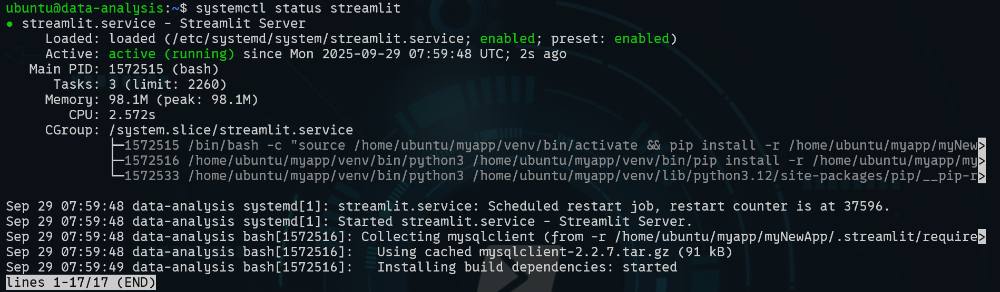
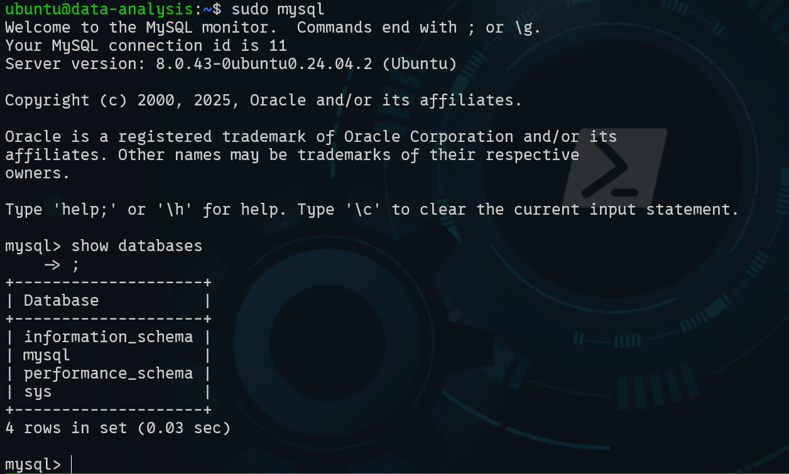

# Learning Diary – Cloud Services

**Student:** Gleb Bulygin

**Group:** DIN24S

**Email:** [gbulygin@students.oamk.fi](gbulygin@students.oamk.fi)

## Week 5 Assignment

> In this assignment you will create simple data analysis pipeline into CSC VM. Example workflow is given. Addition into lecture example, add MySQL database and use your own data for this (you can find data from web such as : https://www.opendata.fi/en )
>
> Submit URL of your online app/webpage, remember to expose app port for everyone in Security Group rules
>
> - [Electric_prices.csv](https://moodle.oulu.fi/pluginfile.php/3173968/mod_assign/introattachment/0/Electric_prices.csv?forcedownload=1) Electric_prices.csv - 17 September 2025, 12:58 PM
> - [Use CSC services to host Streamlit.pdf](https://moodle.oulu.fi/pluginfile.php/3173968/mod_assign/introattachment/0/Use%20CSC%20services%20to%20host%20Streamlit.pdf?forcedownload=1) - 17 September 2025, 12:03 PM

### Create a VM in cPouta service

I have created a new inscance with Ubuntu 24. The whole process of creating of an instance is documented on Week 1 page. I needed to create the `Floating IP` once agan since earlier this course I released the one that I had. But the SSH key pair and `mySecurity` group actually stayed, so I just needed to update my `~\.ssh\config` file with new IP address and I was able to connect to my remote instance. I am using PowerShell for SSH connection.



**Figure 5.1:** _Successful connection to new instance_

### Setup environment and test `Streamlit`

Then I created a folder `myapp` from the test application, `cd` into it, installed python, created python virtual environment `venv` and installed `streamlit` into the `venv`.

```bash
sudo apt update # get list available packages

sudo apt upgrade # update all packages

sudo apt install python3.12-venv # install venv package for python

# Create virtual environment for Python and install Streamlit:

python3 -m venv venv # create virtual environment named venv

source venv/bin/activate # activate the virtual environment

pip install streamlit # install streamlit package

streamlit hello # start streamlit
```

> I added a new TCP rule to `mySecurity` group and opend port 8501.



**Figure 5.2:** _Streamlit running_



**Figure 5.3:** _Streamlit running, browser window_

Then in my home directory I created a new folder `myNewApp`. There I created a new file `streamlit_test.py`.

#### streamlit_test.py

```python
import streamlit as st
import pandas as pd
import plotly.express as px

def main():
  st.title("Plot some data")
  df = pd.read_csv("Electric_prices.csv")
  ff = px.scatter(df, x="Date", y="Price")
  st.plotly_chart(ff, use_container_width=True)

if __name__ == "__main__":
 main()
```

Using WinSCP I copied the [Electric_prices.csv](https://moodle.oulu.fi/pluginfile.php/3173968/mod_assign/introattachment/0/Electric_prices.csv?forcedownload=1) file to the same folder.

Then I stopped the `streamlit hello` and started a new streamlit process:

```bash
# get streamlit process
ps aux | grep streamlit

# kill running process
kill <process PID>

# start a new streamlit process (from ~/myNewApp folder)
streamlit run streamlit_test.py
```

I had an indentation error in my python file a first. After fixing it, everything worked nicely.



**Figure 5.4:** _Basic streamlit example with dummy data_

#### [http://86.50.231.195:8501/](http://86.50.231.195:8501/)

### Setup streamlit to run continiously

in `myNewApp` directoy I created a `.streamlit` directory and inside it `requirements.txt` file.

#### requirements.txt

```
mysqlclient
SQLAlchemy
scipy
```



**Figure 5.5:** _contents of myNewApp directory_

> Here I realized that the python venv is installed inside `myapp` directory. So I moved the whole `myNewApp` inside the `myapp` directory.



**Figure 5.6:** _contents of my `/etc/systemd/system/streamlit.service` file_

```
[Unit]
Description=Streamlit Server
After=network.target

[Service]
User=ubuntu
WorkingDirectory=/home/ubuntu/myapp/myNewApp
ExecStart=/bin/bash -c "source /home/ubuntu/myapp/venv/bin/activate && pip install -r /home/ubuntu/myapp/myNewApp/.streamlit/requirements.txt && streamlit run /home/ubuntu/myapp/myNewApp/Streamlit_test.py"
Restart=always

[Install]
WantedBy=multi-user.target
```

> The ExecStart should not contain any new line characters. It was giving me an "unbalanced quotes" error.



**Figure 5.7:** _streamlit.service status_

### Using MySQL database with the VM

```
# install mySQL
sudo apt install mysql-server

# setup installation
# <nyyyy>
sudo mysql_secure_installation

## start mysql
sudo mysql
```



**Figure 5.8:** _mysql databases after initial setup_

> Before the next step I needed to fix privileges in mysql. I could not login under root user so I did:
>
> ```mysql
> # sudo start mysql
> sudo mysql
>
> # set a password for the root user
> ALTER USER 'root'@'localhost' IDENTIFIED WITH mysql_native_password BY '[password]';
>
> # set privileges
> FLUSH PRIVILEGES;
> ```
