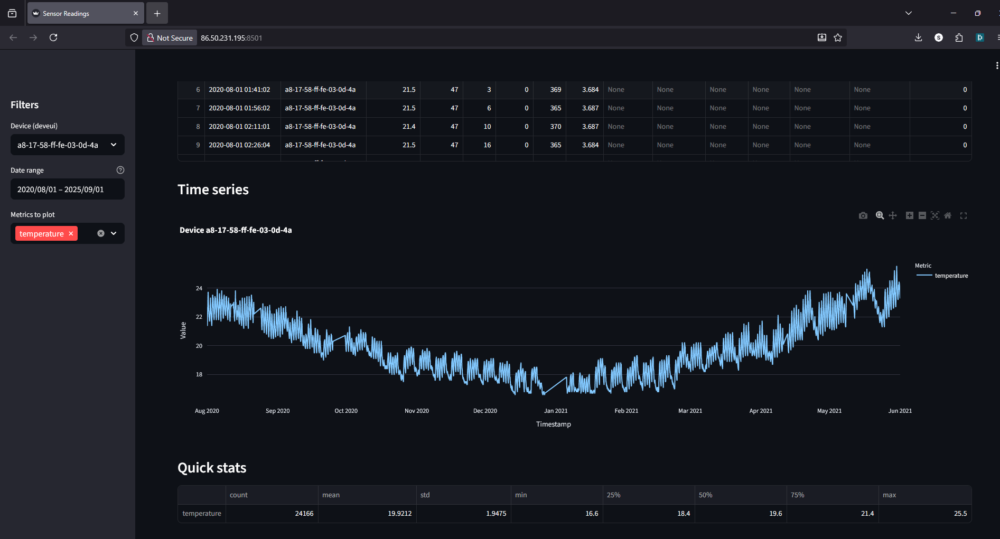

# Learning Diary – Cloud Services

**Student:** Gleb Bulygin

**Group:** DIN24S

**Email:** [gbulygin@students.oamk.fi](gbulygin@students.oamk.fi)

**Link to VM:** http://86.50.231.195:8501/

## Week 5 Assignment

> In this assignment you will create simple data analysis pipeline into CSC VM. Example workflow is given. Addition into lecture example, add MySQL database and use your own data for this (you can find data from web such as : https://www.opendata.fi/en )
>
> Submit URL of your online app/webpage, remember to expose app port for everyone in Security Group rules
>
> - [Electric_prices.csv](https://moodle.oulu.fi/pluginfile.php/3173968/mod_assign/introattachment/0/Electric_prices.csv?forcedownload=1) Electric_prices.csv - 17 September 2025, 12:58 PM
> - [Use CSC services to host Streamlit.pdf](https://moodle.oulu.fi/pluginfile.php/3173968/mod_assign/introattachment/0/Use%20CSC%20services%20to%20host%20Streamlit.pdf?forcedownload=1) - 17 September 2025, 12:03 PM

### Create a VM in cPouta service

I have created a new inscance with Ubuntu 24. The whole process of creating of an instance is documented on Week 1 page. I needed to create the `Floating IP` once agan since earlier this course I released the one that I had. But the SSH key pair and `mySecurity` group actually stayed, so I just needed to update my `~\.ssh\config` file with new IP address and I was able to connect to my remote instance. I am using PowerShell for SSH connection.


**Figure 5.1:** _Successful connection to new instance_

<div style="page-break-after: always;"></div>

### Setup environment and test `Streamlit`

Then I created a folder `myapp` from the test application, `cd` into it, installed python, created python virtual environment `venv` and installed `streamlit` into the `venv`.

```bash
sudo apt update # get list available packages

sudo apt upgrade # update all packages

sudo apt install python3.12-venv # install venv package for python

# Create virtual environment for Python and install Streamlit:

python3 -m venv venv # create virtual environment named venv

source venv/bin/activate # activate the virtual environment

pip install streamlit # install streamlit package

streamlit hello # start streamlit
```

> I added a new TCP rule to `mySecurity` group and opend port 8501.


**Figure 5.2:** _Streamlit running_


**Figure 5.3:** _Streamlit running, browser window_

Then in my home directory I created a new folder `myNewApp`. There I created a new file `streamlit_test.py`.

#### streamlit_test.py

```python
import streamlit as st
import pandas as pd
import plotly.express as px

def main():
  st.title("Plot some data")
  df = pd.read_csv("Electric_prices.csv")
  ff = px.scatter(df, x="Date", y="Price")
  st.plotly_chart(ff, use_container_width=True)

if __name__ == "__main__":
 main()
```

Using WinSCP I copied the [Electric_prices.csv](https://moodle.oulu.fi/pluginfile.php/3173968/mod_assign/introattachment/0/Electric_prices.csv?forcedownload=1) file to the same folder.

<div style="page-break-after: always;"></div>

Then I stopped the `streamlit hello` and started a new streamlit process:

```bash
# get streamlit process
ps aux | grep streamlit

# kill running process
kill <process PID>

# start a new streamlit process (from ~/myNewApp folder)
streamlit run streamlit_test.py
```

I had an indentation error in my python file a first. After fixing it, everything worked nicely.


**Figure 5.4:** _Basic streamlit example with dummy data_

#### [http://86.50.231.195:8501/](http://86.50.231.195:8501/)

<div style="page-break-after: always;"></div>

### Setup streamlit to run continiously

in `myNewApp` directoy I created a `.streamlit` directory and inside it `requirements.txt` file.

#### requirements.txt

```
mysqlclient
SQLAlchemy
scipy
```


**Figure 5.5:** _contents of myNewApp directory_

> Here I realized that the python venv is installed inside `myapp` directory. So I moved the whole `myNewApp` inside the `myapp` directory.


**Figure 5.6:** _contents of my `/etc/systemd/system/streamlit.service` file_

<div style="page-break-after: always;"></div>

```
[Unit]
Description=Streamlit Server
After=network.target

[Service]
User=ubuntu
WorkingDirectory=/home/ubuntu/myapp/myNewApp
ExecStart=/bin/bash -c "source /home/ubuntu/myapp/venv/bin/activate && pip install -r /home/ubuntu/myapp/myNewApp/.streamlit/requirements.txt && streamlit run /home/ubuntu/myapp/myNewApp/Streamlit_test.py"
Restart=always

[Install]
WantedBy=multi-user.target
```

> The ExecStart should not contain any new line characters. It was giving me an "unbalanced quotes" error.


**Figure 5.7:** _streamlit.service status_

### Using MySQL database with the VM

```
# install mySQL
sudo apt install mysql-server

# setup installation
# <nyyyy>
sudo mysql_secure_installation

## start mysql
sudo mysql
```


**Figure 5.8:** _mysql databases after initial setup_

> Before the next step I needed to fix privileges in mysql. I could not login under root user so I did:
>
> ```mysql
> # sudo start mysql
> sudo mysql
>
> # set a password for the root user
> ALTER USER 'root'@'localhost' IDENTIFIED WITH mysql_native_password BY '[password]';
>
> # set privileges
> FLUSH PRIVILEGES;
> ```

I will try (probably) the provided python script, but at first it seems easier to copy my `application.csv` file with WinSCP tool to my VM and incert data from a file.

As data source I chouse the air-quality and motion data from [Smart Campus Oulu dataset](https://www.opendata.fi/data/en_GB/dataset/smart-campus-oulu-linnanmaan-kampuksen-sisatilojen-ilmanlaatu-ja-olosuhdeparametrit).

I put the `application.csv' file to the home directory on my Virtual machine.

Examaple contents of the file:

```csv
time,deveui,temperature,humidity,light,motion,co2,battery,sound_avg,sound_peak,moisture,pressure,acceleration_x,acceleration_y,acceleration_z
1593561602530,a8-17-58-ff-fe-04-64-fb,23.8,48.0,4.0,88.0,,3.638,34.0,64.0,,,,,
1593561602873,a8-17-58-ff-fe-04-65-80,23.9,48.0,3.0,76.0,,3.643,34.0,64.0,,,,,
```

To insert data in the database I logged-in as `root` user

```
# Login as root user
mysql -u root -p

# I was running into an issue:
# 'ERROR 3948 (42000):
#     Loading local data is disabled; this must be enabled on both the client and server sides'

# To fix it I logged in as follows:
sudo mysql --local-infile=1 -u root -p air_quality

# Create a new database 'air_quality'
CREATE DATABASE air_quality;

# use database
USE air_quality;

# Create a table 'sensor_readings'
CREATE TABLE sensor_readings (
  id BIGINT UNSIGNED NOT NULL AUTO_INCREMENT,
  time_ms BIGINT NULL,                 -- raw epoch ms
  time_ts DATETIME NULL,               -- converted timestamp
  deveui VARCHAR(32) NOT NULL,
  temperature DOUBLE NULL,
  humidity DOUBLE NULL,
  light DOUBLE NULL,
  motion DOUBLE NULL,
  co2 DOUBLE NULL,
  battery DOUBLE NULL,
  sound_avg DOUBLE NULL,
  sound_peak DOUBLE NULL,
  moisture DOUBLE NULL,
  pressure DOUBLE NULL,
  acceleration_x DOUBLE NULL,
  acceleration_y DOUBLE NULL,
  acceleration_z DOUBLE NULL,
  PRIMARY KEY (id),
  KEY idx_dev_time (deveui, time_ts)
) ENGINE=InnoDB DEFAULT CHARSET=utf8mb4;


# Load data to the database
LOAD DATA LOCAL INFILE '/home/ubuntu/application.csv'
INTO TABLE sensor_readings
CHARACTER SET utf8mb4
FIELDS TERMINATED BY ',' ENCLOSED BY '"' ESCAPED BY '\\'
LINES TERMINATED BY '\n'               -- if Windows CSV, use '\r\n'
IGNORE 1 LINES
(@time_ms, @deveui, @temperature, @humidity, @light, @motion, @co2, @battery,
 @sound_avg, @sound_peak, @moisture, @pressure, @ax, @ay, @az)
SET
  time_ms       = NULLIF(@time_ms, ''),
  time_ts       = IF(@time_ms = '' OR @time_ms IS NULL, NULL, FROM_UNIXTIME(@time_ms/1000)),
  deveui        = @deveui,
  temperature   = NULLIF(@temperature, ''),
  humidity      = NULLIF(@humidity, ''),
  light         = NULLIF(@light, ''),
  motion        = NULLIF(@motion, ''),
  co2           = NULLIF(@co2, ''),
  battery       = NULLIF(@battery, ''),
  sound_avg     = NULLIF(@sound_avg, ''),
  sound_peak    = NULLIF(@sound_peak, ''),
  moisture      = NULLIF(@moisture, ''),
  pressure      = NULLIF(@pressure, ''),
  acceleration_x= NULLIF(@ax, ''),
  acceleration_y= NULLIF(@ay, ''),
  acceleration_z= NULLIF(@az, '');

# this command took a while to complete

# Grant 'ubuntu' user privileges on 'air_quality' database
GRANT ALL PRIVILEGES ON powerlifting.* TO 'ubuntu'@'localhost';
FLUSH PRIVILEGES;
```


**Figure 5.9:** _sensor_data table_


**Figure 5.10:** _first 10 rows from the **sensor_data** table_


**Figure 5.11:** _10531250 rows in the table **sensor_data** X\_\_x_

Next I enabled mySQL

```bash
sudo systemctl enable mysql
```


**Figure 5.12:** _mySQL enabled_

### Test connection to mySQL

```
mysql -h 127.0.0.1 -u ubuntu -p
```

### Install needed dependencides:

```bash
# install missing python packages
sudo apt install -y pkg-config build-essential python3-dev default-libmysqlclient-dev

# Reinstall python-packages in virtual environment:
source /home/ubuntu/myapp/venv/bin/activate
pip install -r /home/ubuntu/myapp/myNewApp/.streamlit/requirements.txt
```

I have created a `/home/ubuntu/myapp/myNewApp/.streamlit/secrets.toml` file:

```
[connections.mysql]
dialect = "mysql"
host = "localhost"
port = 3306
database = "air_quality"
username = "ubuntu"
password = "<password>"
```

### With some help from ChatGPT I made a streamlit app to plot my data

```python
import streamlit as st
import pandas as pd
import plotly.express as px
from datetime import datetime, date, timedelta

st.set_page_config(page_title="Sensor Readings", layout="wide")

# ---------- Connection ----------
@st.cache_resource
def get_conn():
    # Requires .streamlit/secrets.toml with a [connections.mysql] block
    return st.connection("mysql", type="sql")


# ---------- Cached helpers ----------
@st.cache_data(ttl=600)
def list_devices():
    conn = get_conn()
    q = "SELECT DISTINCT deveui FROM sensor_readings ORDER BY deveui;"
    return conn.query(q)


@st.cache_data(ttl=600)
def get_bounds():
    """Return (min_date, max_date) for time_ts in the table, as DATEs."""
    conn = get_conn()
    q = "SELECT MIN(time_ts) AS min_ts, MAX(time_ts) AS max_ts FROM sensor_readings;"
    b = conn.query(q)
    if b.empty or pd.isna(b.loc[0, "min_ts"]) or pd.isna(b.loc[0, "max_ts"]):
        # Fallback to a synthetic 7-day window ending today if table is empty
        end = datetime.now()
        start = end - timedelta(days=7)
    else:
        start = pd.to_datetime(b.loc[0, "min_ts"]).to_pydatetime()
        end = pd.to_datetime(b.loc[0, "max_ts"]).to_pydatetime()
    return start.date(), end.date()


@st.cache_data(ttl=600)
def load_data(deveui: str, start_dt: datetime, end_dt_excl: datetime):
    """
    Load rows for one device in [start_dt, end_dt_excl) half-open interval.
    """
    conn = get_conn()
    q = """
        SELECT
            time_ts,
            deveui,
            temperature,
            humidity,
            light,
            motion,
            co2,
            battery,
            sound_avg,
            sound_peak,
            moisture,
            pressure,
            acceleration_x,
            acceleration_y,
            acceleration_z
        FROM sensor_readings
        WHERE deveui = :deveui
          AND time_ts >= :start_dt
          AND time_ts <  :end_dt_excl
        ORDER BY time_ts ASC;
    """
    params = {"deveui": deveui, "start_dt": start_dt, "end_dt_excl": end_dt_excl}
    df = conn.query(q, params=params)
    if not df.empty:
        df["time_ts"] = pd.to_datetime(df["time_ts"])
    return df


# ---------- UI ----------
st.title("Plot sensor data from MySQL")
st.write("Visualize values from `sensor_readings`")

with st.sidebar:
    st.header("Filters")

    devices_df = list_devices()
    if devices_df.empty:
        st.error("No devices found in `sensor_readings`.")
        st.stop()

    device = st.selectbox("Device (deveui)", devices_df["deveui"].tolist())

    min_date, max_date = get_bounds()

    # Default to last 7 days within available range
    default_end = max_date
    default_start = min_date

    start_date, end_date = st.date_input(
        "Date range (inclusive)",
        value=(default_start, default_end),
        min_value=min_date,
        max_value=max_date,
        help="Filters by `time_ts`. End date is inclusive."
    )

    # Normalize to datetimes: inclusive start, exclusive end (end + 1 day at 00:00)
    if isinstance(start_date, date) and isinstance(end_date, date):
        start_dt = datetime.combine(start_date, datetime.min.time())
        end_dt_excl = datetime.combine(end_date + timedelta(days=1), datetime.min.time())
    else:
        # Single date selected -> treat as one-day range
        start_dt = datetime.combine(start_date, datetime.min.time())
        end_dt_excl = datetime.combine(start_date + timedelta(days=1), datetime.min.time())

    metrics_all = [
        "temperature", "humidity", "light", "motion", "co2", "battery",
        "sound_avg", "sound_peak", "moisture", "pressure",
        "acceleration_x", "acceleration_y", "acceleration_z"
    ]
    metrics = st.multiselect(
        "Metrics to plot",
        metrics_all,
        default=["temperature", "humidity", "co2"]
    )

# ---------- Data & visuals ----------
df = load_data(device, start_dt, end_dt_excl)

if df.empty:
    st.warning("No data for the selected filters.")
    st.stop()

st.subheader("Sample rows")
st.dataframe(df.head(100), use_container_width=True)

if metrics:
    plot_df = df[["time_ts"] + metrics].melt(
        id_vars="time_ts", var_name="metric", value_name="value"
    )
    plot_df = plot_df.dropna(subset=["value"])

    st.subheader("Time series")
    fig = px.line(
        plot_df,
        x="time_ts",
        y="value",
        color="metric",
        labels={"time_ts": "Timestamp", "value": "Value", "metric": "Metric"},
        title=f"Device {device}",
    )
    st.plotly_chart(fig, use_container_width=True)
else:
    st.info("Pick at least one metric to plot.")

st.subheader("Quick stats")
if metrics:
    stats = df[metrics].describe().T
    st.dataframe(stats, use_container_width=True)
else:
    st.write("No metrics selected.")


```

<div style="page-break-after: always;"></div>

### App is working!

The dataset begins on 1.7.2020, this initial release containing data until 1.6.2021.

The app is rather slow since the VM I am using is quite minimal. So the initial load might be quite long (it checks minimum and maximum dates of the dataset). But after that it works just fine.

The app allows user to filter the data by device (deveui), date and the table headers. It builds the table as well as the graph and Quick Stats.



**Figure 5.13:** _Streamlit app running_
