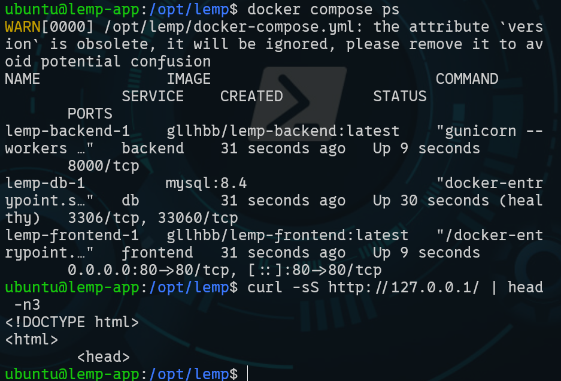
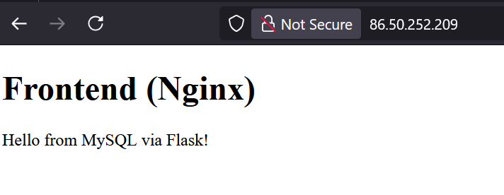
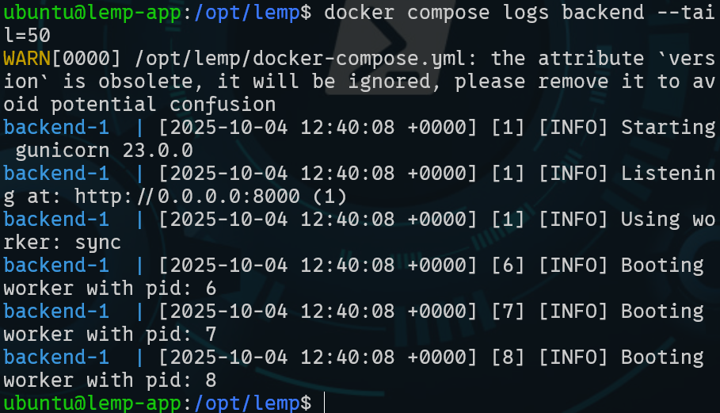
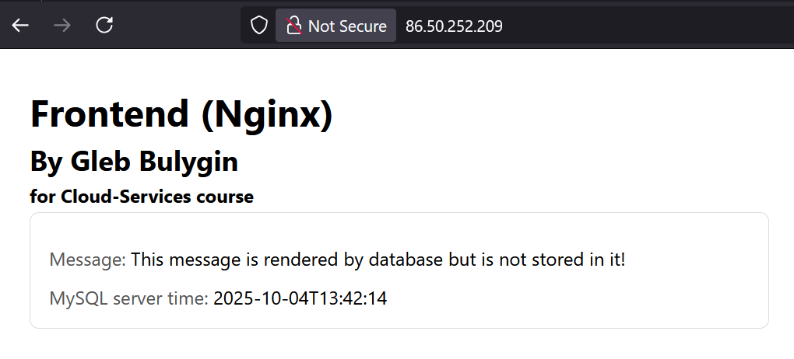

# Learning Diary – Cloud Services

**Student:** Gleb Bulygin

**Group:** DIN24S

**Email:** [gbulygin@students.oamk.fi](gbulygin@students.oamk.fi)

**Link to VM:** [http://86.50.252.209/](http://86.50.252.209/)
**lemp-containers repo (private):** [https://github.com/gllbhh/lemp-containers](https://github.com/gllbhh/lemp-containers)

## Week 6 Assignment

I started by creating a new VM on cPouta portal. Settings are pretty much the same as before. I added a new floating IP addrees and alocated it to the new instance.


**Figure 6.1:** _New instance added_

### Creating file structure for the projects

````powerShell
# command adapted for powerShell
mkdir -Force .\lemp-containers\backend, .\lemp-containers\frontend, .\lemp-containers\db\init
```\

<div style="page-break-after: always;"></div>

### Backend files

<details>
  <summary>app.py</summary>

`.\backend\app.py`

```python
from flask import Flask, jsonify
import os
import mysql.connector

app = Flask(__name__)
DB_HOST = os.getenv('DB_HOST', 'db')
DB_USER = os.getenv('DB_USER', 'appuser')
DB_PASSWORD = os.getenv('DB_PASSWORD', 'changeme')
DB_NAME = os.getenv('DB_NAME', 'appdb')

@app.get('/api/health')
def health():
    return {'status': 'ok'}

@app.get('/api')
def index():
    """Simple endpoint that greets from DB."""
    conn = mysql.connector.connect(
    host=DB_HOST,
    user=DB_USER,
    password=DB_PASSWORD,
    database=DB_NAME,
    )
    cur = conn.cursor()
    cur.execute("SELECT 'Hello from MySQL via Flask!'")
    row = cur.fetchone()
    cur.close(); conn.close()
    return jsonify(message=row[0])

if __name__ == '__main__':
# Dev-only fallback
    app.run(host='0.0.0.0', port=8000, debug=True)
````

</details>

<details>
  <summary>requirements.txt</summary>
`.\backend\requirements.txt`

```
flask==3.0.3
gunicorn==23.0.0
mysql-connector-python==9.0.0
```

</details>

<div style="page-break-after: always;"></div>

<details>
  <summary>Dockerfile</summary>
`.\backend\Dockerfile`

```docker
# syntax=docker/dockerfile:1
FROM python:3.11-slim AS base
ENV PYTHONDONTWRITEBYTECODE=1 PYTHONUNBUFFERED=1
WORKDIR /app
COPY backend/requirements.txt /app/requirements.txt
RUN pip install --no-cache-dir -r requirements.txt
COPY backend/ /app/
EXPOSE 8000
# Gunicorn: bind to all interfaces, 3 workers
CMD ["gunicorn", "--workers", "3", "--bind", "0.0.0.0:8000", "app:app"]
```

</details>

### Frontend Files

<details>
  <summary>index.html</summary>

`.\frontend\index.html`

```html
<!DOCTYPE html>
<html>
	<head>
		<meta charset="utf-8" />
		<title>My LEMP</title>
	</head>
	<body>
		<h1>Frontend (Nginx)</h1>
		<div id="msg">Loading...</div>
		<script>
			fetch("/api")
				.then((r) => r.json())
				.then((d) => {
					document.getElementById("msg").innerText = d.message;
				})
				.catch((e) => {
					document.getElementById("msg").innerText = "API error: " + e;
				});
		</script>
	</body>
</html>
```

</details>

<div style="page-break-after: always;"></div>

<details>
<summary>nginx.conf</summary>

`.\frontend\nginx.conf`

```nginx
events {}
http {
    server {
        listen 80;
        server_name _;
        location / {
        root /usr/share/nginx/html;
        index index.html;
        try_files $uri /index.html;
        }
        location /api {
            proxy_pass http://backend:8000;
            proxy_set_header Host $host;
            proxy_set_header X-Real-IP $remote_addr;
            proxy_set_header X-Forwarded-For $proxy_add_x_forwarded_for;
            proxy_set_header X-Forwarded-Proto $scheme;
        }
    }
}
```

</details>
<details>
<summary>Dockerfile</summary>

`.\frontend\dockerfile`

```docker
# syntax=docker/dockerfile:1
FROM nginx:1.27-alpine
# Copy Nginx config and static assets
COPY frontend/nginx.conf /etc/nginx/nginx.conf
COPY frontend/index.html /usr/share/nginx/html/index.html
EXPOSE 80
```

</details>

### Database

<details>
<summary>init.sql</summary>

`.\db\init\init.sql`

```sql
CREATE DATABASE IF NOT EXISTS appdb;
CREATE USER IF NOT EXISTS 'appuser'@'%' IDENTIFIED BY 'wled1234';
GRANT ALL PRIVILEGES ON appdb.* TO 'appuser'@'%';
FLUSH PRIVILEGES;
```

</details>

### Docker Compose for Local Development

<details>
<summary>.env</summary>

`.\.env`

```
DOCKERHUB_USERNAME=<docker_username>
MYSQL_ROOT_PASSWORD=<mysql_root_password>
DB_HOST=db
DB_USER=appuser
DB_PASSWORD=<db_password>
DB_NAME=appdb
```

</details>

<details>
<summary>docker-compose.dev.yml</summary>

`.\docker-compose.dev.yml`

```yml
version: "3.9"

services:
  db:
    image: mysql:8.4
    environment:
      MYSQL_ROOT_PASSWORD: ${MYSQL_ROOT_PASSWORD}
      # Optional (see notes below):
      # MYSQL_DATABASE: ${DB_NAME}
      # MYSQL_USER: ${DB_USER}
      # MYSQL_PASSWORD: ${DB_PASSWORD}
    volumes:
      - db_data:/var/lib/mysql
      - ./db/init:/docker-entrypoint-initdb.d:ro
    healthcheck:
      test: ["CMD", "mysqladmin", "ping", "-h", "127.0.0.1"]
      interval: 5s
      timeout: 3s
      retries: 20

  backend:
    build:
      context: .
      dockerfile: backend/Dockerfile
    environment:
      DB_HOST: ${DB_HOST}
      DB_USER: ${DB_USER}
      DB_PASSWORD: ${DB_PASSWORD}
      DB_NAME: ${DB_NAME}
    depends_on:
      db:
        condition: service_healthy
    ports:
      - "8000:8000" # optional for direct dev testing

  frontend:
    build:
      context: .
      dockerfile: frontend/Dockerfile
    depends_on:
      - backend
    ports:
      - "8080:80"

volumes:
  db_data:
```

</details>

<div style="page-break-after: always;"></div>

<details>
<summary>docker-compose.prod.yml</summary>

`.\docker-compose.prod.yml`

```yml
version: "3.9"

services:
  db:
    image: mysql:8.4
    environment:
      MYSQL_ROOT_PASSWORD: ${MYSQL_ROOT_PASSWORD}
    volumes:
      - db_data:/var/lib/mysql
      - ./db/init:/docker-entrypoint-initdb.d:ro
    healthcheck:
      test: ["CMD", "mysqladmin", "ping", "-h", "127.0.0.1"]
      interval: 5s
      timeout: 3s
      retries: 20

  backend:
    image: ${DOCKERHUB_USERNAME}/lemp-backend:latest
    environment:
      DB_HOST: db
      DB_USER: ${DB_USER}
      DB_PASSWORD: ${DB_PASSWORD}
      DB_NAME: ${DB_NAME}
    depends_on:
      db:
        condition: service_healthy

  frontend:
    image: ${DOCKERHUB_USERNAME}/lemp-frontend:latest
    depends_on:
      - backend
    ports:
      - "80:80" # expose only frontend to the host

volumes:
  db_data:
```

</details>

<div style="page-break-after: always;"></div>

### Run the container locally

I work on Windows machine, so commands are different from the example.

```powerShell
# build docker containers
docker compose -f docker-compose.dev.yml --env-file .env up --build -d

# test frontend
(wget http://127.0.0.1:8080/).content

# test backend
Invoke-RestMethod http://127.0.0.1:8080/api | ConvertTo-Json -Depth 10
```


**Figure 6.2:** _Frontend running locally_


**Figure 6.3:** _Backend Running locally_

<div style="page-break-after: always;"></div>

### Build, Tag, and Push Images to Docker Hub

> commands adapted for Windows!

```powerShell
# Login (only once)
docker login

# set env variable
$env:DOCKERHUB_USERNAME="dockerhub_username"

# Backend build and tag
docker build -f backend/Dockerfile -t "$env:DOCKERHUB_USERNAME/lemp-backend:1.0.0" .

docker tag "$env:DOCKERHUB_USERNAME/lemp-backend:1.0.0" "$env:DOCKERHUB_USERNAME/lemp-backend:latest"


# Frontend: build & tag
docker build -f frontend/Dockerfile -t "$env:DOCKERHUB_USERNAME/lemp-frontend:1.0.0" .

docker tag "$env:DOCKERHUB_USERNAME/lemp-frontend:1.0.0" "$env:DOCKERHUB_USERNAME/lemp-frontend:latest"


# Push
docker push "$env:DOCKERHUB_USERNAME/lemp-backend:1.0.0"
docker push "$env:DOCKERHUB_USERNAME/lemp-backend:latest"
docker push "$env:DOCKERHUB_USERNAME/lemp-frontend:1.0.0"
docker push "$env:DOCKERHUB_USERNAME/lemp-frontend:latest"
```

<div style="page-break-after: always;"></div>

### Prepare VM for deployment

Commands on virtual machine:

```bash
# Update the package index and install prerequisites (certificates, curl, GPG tools)
sudo apt update && sudo apt install -y ca-certificates curl gnupg

# Create the directory where Docker’s GPG key will be stored
sudo install -m 0755 -d /etc/apt/keyrings

# Download Docker’s official GPG key and save it in the keyrings directory
curl -fsSL https://download.docker.com/linux/ubuntu/gpg | sudo gpg --dearmor -o /etc/apt/keyrings/docker.gpg

# Set read permissions on the key so apt can use it
sudo chmod a+r /etc/apt/keyrings/docker.gpg

# Add Docker’s official apt repository to your sources list
# $(dpkg --print-architecture) → ensures the right architecture (e.g. amd64, arm64)
# $(. /etc/os-release && echo $VERSION_CODENAME) → ensures the right Ubuntu codename (e.g. jammy, noble)
echo \
  "deb [arch=$(dpkg --print-architecture) signed-by=/etc/apt/keyrings/docker.gpg] \
  https://download.docker.com/linux/ubuntu \
  $(. /etc/os-release && echo $VERSION_CODENAME) stable" | \
  sudo tee /etc/apt/sources.list.d/docker.list > /dev/null

# Update apt again (now it will include the new Docker repo)
sudo apt update

# Install Docker Engine, CLI, container runtime, Buildx, and Compose plugin
sudo apt install -y docker-ce docker-ce-cli containerd.io docker-buildx-plugin docker-compose-plugin

# Run the official hello-world image as a test (requires sudo if user not in docker group yet)
sudo docker run hello-world

# Add your user to the 'docker' group so you can run Docker without sudo
sudo usermod -aG docker $USER

# Apply new group membership immediately (start a new shell with docker group)
newgrp docker

# Run the hello-world test again, this time without sudo
docker run hello-world
```

### Clone repo on VM

I have initialized a git repo in the `lemp-containers` folder and pushed it to my github repo.

Now I need to prepare the VM to clone the repo.

```bash
### Generate a new SSH key pair
ssh-keygen -t ed25519 -C "you@example.com"

cat ~/.ssh/id_ed25519.pub   # add this at GitHub (web interface) → Settings → SSH keys

ssh -T git@github.com       # should say “Hi <username>!”

git clone git@github.com:<your-username>/lemp-containers.git

```

I have cloned my repo to home directory on my VM.

I have accidentaly pushed by `.env` to the github repo. But added it to `.gitignore` and removed it with next commit. I just cpoied the contents of my `.env` to `.env` on the VM. And then I needed to do the same for `docker-compose.dev.yml` and `docker-compose.prod.yml` files (remove them form repo and add them to .gitignore).

### Setup the app on the VM

```bash
# Create a target directory for your app stack
sudo mkdir /opt/lemp

# Copy the environment file into /opt/lemp
sudo cp ./lemp-containers/.env /opt/lemp/

# Copy the production docker-compose file and rename it to docker-compose.yml
sudo cp ./lemp-containers/docker-compose.prod.yml /opt/lemp/docker-compose.yml

# Ensure the db/init directory exists under /opt/lemp
mkdir -p /opt/lemp/db/init/

# Copy the SQL initialization script into the right location
sudo cp ./lemp-containers/db/init/init.sql /opt/lemp/db/init/

# Move into the deployment directory
cd /opt/lemp

# Authenticate with Docker Hub (opens a browser-based login)
docker login

# Pull prebuilt images defined in docker-compose.yml using the .env file
docker compose --env-file .env pull

# Start the containers in detached mode
docker compose --env-file .env up -d

# --- Verification steps ---

# Show the status of running services
docker compose ps

# Tail the last 100 lines of logs from all services, follow live output
docker compose logs -f --tail=100

# Test frontend (via curl to localhost), show first 3 lines of the response
curl -sS http://127.0.0.1/ | head -n3

# Tail the last 50 lines of logs from the backend service only
docker compose logs backend --tail=50
```



**Figure 6.4:** _App running on VM_



**Figure 6.5:** _Browser View_



**Figure 6.6:** _Docker Error log_

### Updating the app

I have updated the `app.py`, `nginx.conf`, and `index.html` files so the display the the time from the database (on my development machine).

<div style="page-break-after: always;"></div>

Then ran following commands:

```powershell
# Run local dev stack (rebuild all images defined in docker-compose.dev.yml)
docker compose -f docker-compose.dev.yml --env-file .env up --build -d

# --- Backend: build and tag ---
# Build backend image from backend/Dockerfile, tag it as version 1.0.1
docker build -f backend/Dockerfile -t "$env:DOCKERHUB_USERNAME/lemp-backend:1.0.1" .

# Tag the same backend image also as 'latest'
docker tag "$env:DOCKERHUB_USERNAME/lemp-backend:1.0.1" "$env:DOCKERHUB_USERNAME/lemp-backend:latest"

# --- Frontend: build and tag ---
# Build frontend image from frontend/Dockerfile, tag it as version 1.0.1
docker build -f frontend/Dockerfile -t "$env:DOCKERHUB_USERNAME/lemp-frontend:1.0.1" .

# Tag the same frontend image also as 'latest'
docker tag "$env:DOCKERHUB_USERNAME/lemp-frontend:1.0.1" "$env:DOCKERHUB_USERNAME/lemp-frontend:latest"

# --- Push images to Docker Hub ---
# Push backend version 1.0.1 and latest
docker push "$env:DOCKERHUB_USERNAME/lemp-backend:1.0.1"
docker push "$env:DOCKERHUB_USERNAME/lemp-backend:latest"

# Push frontend version 1.0.1 and latest
docker push "$env:DOCKERHUB_USERNAME/lemp-frontend:1.0.1"
docker push "$env:DOCKERHUB_USERNAME/lemp-frontend:latest"

```

Ano on the VM from `/opt/lemp/` folder:

```bash
# Pull the latest versions of all images defined in docker-compose.yml
docker compose pull

# Start containers in detached mode (runs in background)
docker compose up -d
```



**Figure 6.7:** _Updated app running on VM_
