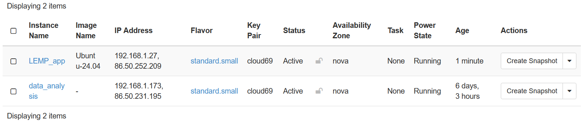
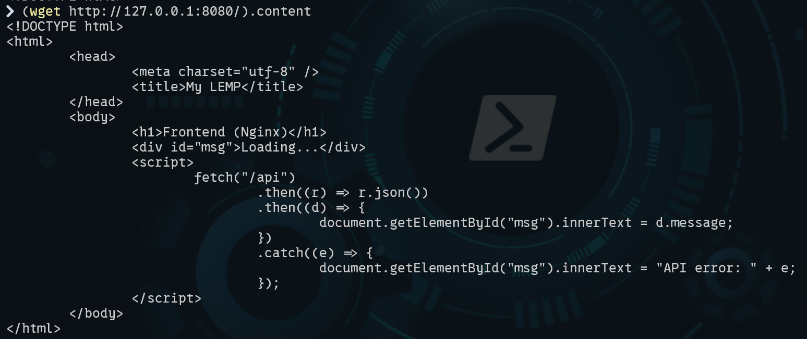
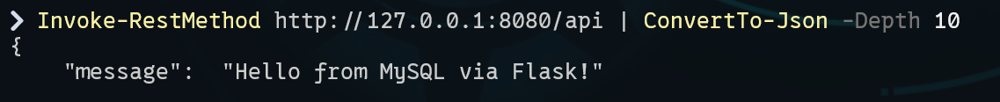

# Learning Diary – Cloud Services

**Student:** Gleb Bulygin

**Group:** DIN24S

**Email:** [gbulygin@students.oamk.fi](gbulygin@students.oamk.fi)

**Link to VM:** http://86.50.252.209/

## Week 6 Assignment

I started by creating a new VM on cPouta portal. Settings are pretty much the same as before. I added a new floating IP addrees and alocated it to the new instance.



**Figure 6.1:** _New instance added_

### Creating file structure for the projects

```powerShell
# command adapted for powerShell
mkdir -Force .\lemp-containers\backend, .\lemp-containers\frontend, .\lemp-containers\db\init
```

### Backend files

<details>
  <summary>app.py</summary>

`.\backend\app.py`

```python
from flask import Flask, jsonify
import os
import mysql.connector

app = Flask(__name__)
DB_HOST = os.getenv('DB_HOST', 'db')
DB_USER = os.getenv('DB_USER', 'appuser')
DB_PASSWORD = os.getenv('DB_PASSWORD', 'changeme')
DB_NAME = os.getenv('DB_NAME', 'appdb')

@app.get('/api/health')
def health():
    return {'status': 'ok'}

@app.get('/api')
def index():
    """Simple endpoint that greets from DB."""
    conn = mysql.connector.connect(
    host=DB_HOST,
    user=DB_USER,
    password=DB_PASSWORD,
    database=DB_NAME,
    )
    cur = conn.cursor()
    cur.execute("SELECT 'Hello from MySQL via Flask!'")
    row = cur.fetchone()
    cur.close(); conn.close()
    return jsonify(message=row[0])

if __name__ == '__main__':
# Dev-only fallback
    app.run(host='0.0.0.0', port=8000, debug=True)
```

</details>

<details>
  <summary>requirements.txt</summary>
`.\backend\requirements.txt`

```
flask==3.0.3
gunicorn==23.0.0
mysql-connector-python==9.0.0
```

</details>

<details>
  <summary>Dockerfile</summary>
`.\backend\Dockerfile`

```docker
# syntax=docker/dockerfile:1
FROM python:3.11-slim AS base
ENV PYTHONDONTWRITEBYTECODE=1 PYTHONUNBUFFERED=1
WORKDIR /app
COPY backend/requirements.txt /app/requirements.txt
RUN pip install --no-cache-dir -r requirements.txt
COPY backend/ /app/
EXPOSE 8000
# Gunicorn: bind to all interfaces, 3 workers
CMD ["gunicorn", "--workers", "3", "--bind", "0.0.0.0:8000", "app:app"]
```

</details>

### Frontend Files

<details>
  <summary>index.html</summary>

`.\frontend\index.html`

```html
<!DOCTYPE html>
<html>
	<head>
		<meta charset="utf-8" />
		<title>My LEMP</title>
	</head>
	<body>
		<h1>Frontend (Nginx)</h1>
		<div id="msg">Loading...</div>
		<script>
			fetch("/api")
				.then((r) => r.json())
				.then((d) => {
					document.getElementById("msg").innerText = d.message;
				})
				.catch((e) => {
					document.getElementById("msg").innerText = "API error: " + e;
				});
		</script>
	</body>
</html>
```

</details>

<details>
<summary>nginx.conf</summary>

`.\frontend\nginx.conf`

```nginx
events {}
http {
    server {
        listen 80;
        server_name _;
        location / {
        root /usr/share/nginx/html;
        index index.html;
        try_files $uri /index.html;
        }
        location /api {
            proxy_pass http://backend:8000;
            proxy_set_header Host $host;
            proxy_set_header X-Real-IP $remote_addr;
            proxy_set_header X-Forwarded-For $proxy_add_x_forwarded_for;
            proxy_set_header X-Forwarded-Proto $scheme;
        }
    }
}
```

</details>
<details>
<summary>Dockerfile</summary>

`.\frontend\dockerfile`

```docker
# syntax=docker/dockerfile:1
FROM nginx:1.27-alpine
# Copy Nginx config and static assets
COPY frontend/nginx.conf /etc/nginx/nginx.conf
COPY frontend/index.html /usr/share/nginx/html/index.html
EXPOSE 80
```

</details>

### Database

<details>
<summary>init.sql</summary>

`.\db\init\init.sql`

```sql
CREATE DATABASE IF NOT EXISTS appdb;
CREATE USER IF NOT EXISTS 'appuser'@'%' IDENTIFIED BY 'wled1234';
GRANT ALL PRIVILEGES ON appdb.* TO 'appuser'@'%';
FLUSH PRIVILEGES;
```

</details>

### Docker Compose for Local Development

<details>
<summary>.env</summary>

`.\.env`

```
DOCKERHUB_USERNAME=<docker_username>
MYSQL_ROOT_PASSWORD=<mysql_root_password>
DB_HOST=db
DB_USER=appuser
DB_PASSWORD=<db_password>
DB_NAME=appdb
```

</details>

<details>
<summary>docker-compose.dev.yml</summary>

`.\docker-compose.dev.yml`

```yml
version: "3.9"

services:
  db:
    image: mysql:8.4
    environment:
      MYSQL_ROOT_PASSWORD: ${MYSQL_ROOT_PASSWORD}
      # Optional (see notes below):
      # MYSQL_DATABASE: ${DB_NAME}
      # MYSQL_USER: ${DB_USER}
      # MYSQL_PASSWORD: ${DB_PASSWORD}
    volumes:
      - db_data:/var/lib/mysql
      - ./db/init:/docker-entrypoint-initdb.d:ro
    healthcheck:
      test: ["CMD", "mysqladmin", "ping", "-h", "127.0.0.1"]
      interval: 5s
      timeout: 3s
      retries: 20

  backend:
    build:
      context: .
      dockerfile: backend/Dockerfile
    environment:
      DB_HOST: ${DB_HOST}
      DB_USER: ${DB_USER}
      DB_PASSWORD: ${DB_PASSWORD}
      DB_NAME: ${DB_NAME}
    depends_on:
      db:
        condition: service_healthy
    ports:
      - "8000:8000" # optional for direct dev testing

  frontend:
    build:
      context: .
      dockerfile: frontend/Dockerfile
    depends_on:
      - backend
    ports:
      - "8080:80"

volumes:
  db_data:
```

</details>

### Run the container locally

I work on Windows machine, so commands are different from the example.

```powerShell
# build docker containers
docker compose -f docker-compose.dev.yml --env-file .env up --build -d

# test frontend
(wget http://127.0.0.1:8080/).content

# test backend
Invoke-RestMethod http://127.0.0.1:8080/api | ConvertTo-Json -Depth 10
```



**Figure 6.2:** _Frontend running locally_



**Figure 6.3:** _Backend Running locally_

### Build, Tag, and Push Images to Docker Hub

```powerShell
# Login (only once)
docker login

# Backend build and tag
docker build -f backend/Dockerfile -t ${DOCKERHUB_USERNAME}/lemp-backend:1.0.0 .

docker tag ${DOCKERHUB_USERNAME}/lemp-backend:1.0.0 ${DOCKERHUB_USERNAME}/lemp-backend:latest

# Frontend: build & tag
docker build -f frontend/Dockerfile -t ${DOCKERHUB_USERNAME}/lemp-frontend:1.0.0 .

docker tag ${DOCKERHUB_USERNAME}/lemp-frontend:1.0.0 ${DOCKERHUB_USERNAME}/lemp-frontend:latest

# Push
docker push ${DOCKERHUB_USERNAME}/lemp-backend:1.0.0
docker push ${DOCKERHUB_USERNAME}/lemp-backend:latest
docker push ${DOCKERHUB_USERNAME}/lemp-frontend:1.0.0
docker push ${DOCKERHUB_USERNAME}/lemp-frontend:latest


```
