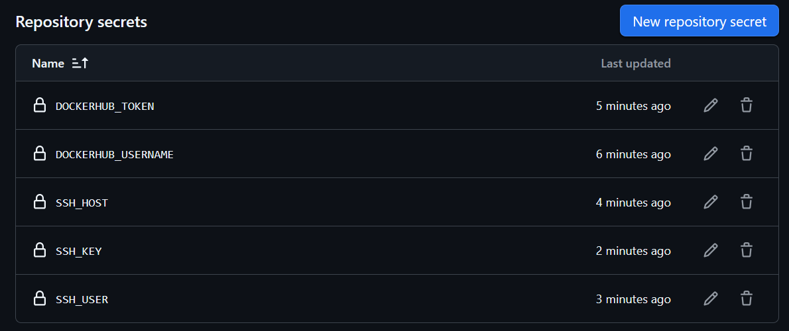
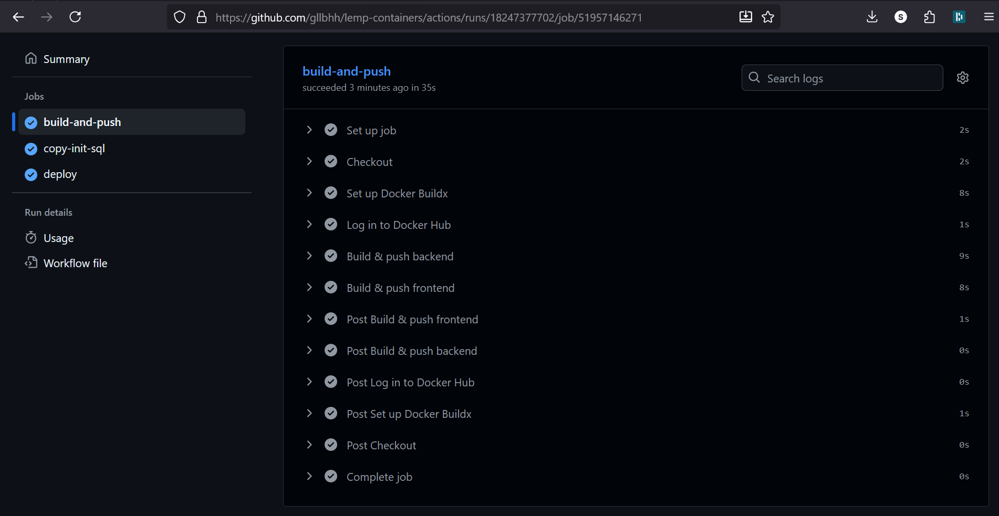
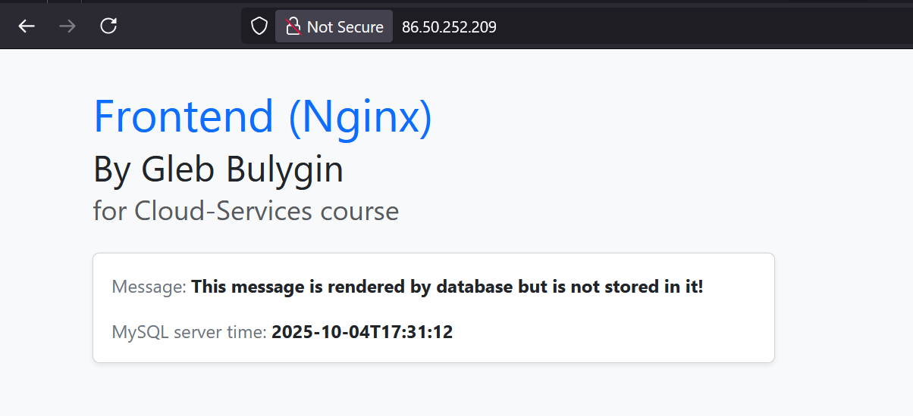

# Learning Diary – Cloud Services

**Student:** Gleb Bulygin

**Group:** DIN24S

**Email:** [gbulygin@students.oamk.fi](gbulygin@students.oamk.fi)

**Link to VM:** [http://86.50.252.209/](http://86.50.252.209/)
**lemp-containers repo (now public):** [https://github.com/gllbhh/lemp-containers](https://github.com/gllbhh/lemp-containers)

---

This work extends [Week 6](https://github.com/gllbhh/cloud-servises/tree/main/week06) with github actions workflow.

Github will look for `.github/workflows` directory and try to execute actions specified in `.yml` file there.

I use [this](https://github.com/Vikke82/lemp_kontit/blob/main/.github/workflows/deploy.yml) file as an example.

<details>
  <summary>deploy.yml</summary>

`./github/workflows/deploy.yml`

```yml
name: CI/CD for LEMP Containers

on:
  push:
    branches: [main]
    tags: ["v*"] # optional: run on version tags, e.g., v1.0.0

jobs:
  build-and-push:
    runs-on: ubuntu-latest
    permissions:
      contents: read
      packages: write
    steps:
      - name: Checkout
        uses: actions/checkout@v4

      - name: Set up Docker Buildx
        uses: docker/setup-buildx-action@v3

      - name: Log in to Docker Hub
        uses: docker/login-action@v3
        with:
          username: ${{ secrets.DOCKERHUB_USERNAME }}
          password: ${{ secrets.DOCKERHUB_TOKEN }}

      - name: Build & push backend
        uses: docker/build-push-action@v5
        with:
          context: .
          file: backend/Dockerfile
          push: true
          tags: |
            ${{ secrets.DOCKERHUB_USERNAME }}/lemp-backend:latest
            ${{ secrets.DOCKERHUB_USERNAME }}/lemp-backend:${{ github.sha }}
          cache-from: type=registry,ref=${{ secrets.DOCKERHUB_USERNAME }}/lemp-backend:latest
          cache-to: type=inline

      - name: Build & push frontend
        uses: docker/build-push-action@v5
        with:
          context: .
          file: frontend/Dockerfile
          push: true
          tags: |
            ${{ secrets.DOCKERHUB_USERNAME }}/lemp-frontend:latest
            ${{ secrets.DOCKERHUB_USERNAME }}/lemp-frontend:${{ github.sha }}
          cache-from: type=registry,ref=${{ secrets.DOCKERHUB_USERNAME }}/lemp-frontend:latest
          cache-to: type=inline

  copy-init-sql:
    runs-on: ubuntu-latest
    needs: build-and-push
    steps:
      - name: Checkout repository
        uses: actions/checkout@v4

      - name: Ensure target directory exists on VM
        uses: appleboy/ssh-action@v1.0.3
        with:
          host: ${{ secrets.SSH_HOST }}
          username: ${{ secrets.SSH_USER }}
          key: ${{ secrets.SSH_KEY }}
          port: 22
          script: |
            cd /
            mkdir -p /opt/lemp/db/init/

      - name: Set permissions for /opt/lemp/db/init/
        uses: appleboy/ssh-action@v1.0.3
        with:
          host: ${{ secrets.SSH_HOST }}
          username: ${{ secrets.SSH_USER }}
          key: ${{ secrets.SSH_KEY }}
          port: 22
          script: |
            sudo chown -R $(whoami) /opt/lemp/db/init/
            sudo chmod -R u+w /opt/lemp/db/init/

      - name: Copy init.sql to VM
        uses: appleboy/scp-action@v0.1.4
        with:
          host: ${{ secrets.SSH_HOST }}
          username: ${{ secrets.SSH_USER }}
          key: ${{ secrets.SSH_KEY }}
          port: 22
          source: db/init/init.sql
          target: /opt/lemp/db/init/
          strip_components: 2

  deploy:
    runs-on: ubuntu-latest
    needs: copy-init-sql
    steps:
      - name: Deploy to VM via SSH
        uses: appleboy/ssh-action@v1.0.3
        with:
          host: ${{ secrets.SSH_HOST }}
          username: ${{ secrets.SSH_USER }}
          key: ${{ secrets.SSH_KEY }}
          port: 22
          script: |
            set -e
            cd /opt/lemp

            if [ ! -d "/var/lib/docker/volumes/lemp_db_data" ]; then
              docker compose down -v
            else
              docker compose down
            fi

            docker compose pull
            docker compose up -d
            docker compose ps
```

</details>

### What this workflow does

- Triggers: Runs on pushes to main and on tags matching v\* (e.g. v1.0.0).
- Job 1: build-and-push
  - Checks out the repo.
  - Sets up Docker Buildx.
  - Logs in to Docker Hub.
  - Builds & pushes two images:
    - backend from backend/Dockerfile
    - frontend from frontend/Dockerfile
  - Each image is tagged twice:
    - :latest
    - :${{ github.sha }} (immutable build ID)
  - Uses registry cache to speed up builds.
- Job 2: copy-init-sql (waits for Job 1)
  - SSH’s into your VM to ensure /opt/lemp/db/init/ exists and is writable.
  - SCP’s db/init/init.sql to /opt/lemp/db/init/ on the VM.
- Job 3: deploy (waits for Job 2)
  - SSH’s into the VM, cd /opt/lemp.
  - If the named volume directory for DB doesn’t exist, it runs docker compose down -v (full reset). Otherwise a normal down.
  - Pulls the freshly-pushed images, brings the stack up in background, and shows status.

### Assumptions on the VM:

- /opt/lemp already contains your docker-compose.yml (prod) and a valid .env.
- Docker & Docker Compose v2 are installed.
- If your images are private on Docker Hub, the VM is already docker login’d (the workflow doesn’t log in on the VM).

I added following secrets to my `lemp-containers` repo:



**Figure 7.1:** _Github Secrets_

My ssh key was protected by a passphrase so I added it to github secrets (not really secure but I am running out of time to finnish this task)

<details>
  <summary>updated deploy.yml</summary>

```yml
name: CI/CD for LEMP Containers

on:
  push:
    branches: [main]
    tags: ["v*"] # optional: run on version tags, e.g., v1.0.0
  workflow_dispatch: {}

jobs:
  build-and-push:
    runs-on: ubuntu-latest
    permissions:
      contents: read
      packages: write
    steps:
      - name: Checkout
        uses: actions/checkout@v4

      - name: Set up Docker Buildx
        uses: docker/setup-buildx-action@v3

      - name: Log in to Docker Hub
        uses: docker/login-action@v3
        with:
          username: ${{ secrets.DOCKERHUB_USERNAME }}
          password: ${{ secrets.DOCKERHUB_TOKEN }}

      - name: Build & push backend
        uses: docker/build-push-action@v5
        with:
          context: .
          file: backend/Dockerfile
          push: true
          tags: |
            ${{ secrets.DOCKERHUB_USERNAME }}/lemp-backend:latest
            ${{ secrets.DOCKERHUB_USERNAME }}/lemp-backend:${{ github.sha }}
          cache-from: type=registry,ref=${{ secrets.DOCKERHUB_USERNAME }}/lemp-backend:latest
          cache-to: type=inline

      - name: Build & push frontend
        uses: docker/build-push-action@v5
        with:
          context: .
          file: frontend/Dockerfile
          push: true
          tags: |
            ${{ secrets.DOCKERHUB_USERNAME }}/lemp-frontend:latest
            ${{ secrets.DOCKERHUB_USERNAME }}/lemp-frontend:${{ github.sha }}
          cache-from: type=registry,ref=${{ secrets.DOCKERHUB_USERNAME }}/lemp-frontend:latest
          cache-to: type=inline

  copy-init-sql:
    runs-on: ubuntu-latest
    needs: build-and-push
    steps:
      - name: Checkout repository
        uses: actions/checkout@v4

      - name: Ensure target directory exists on VM
        uses: appleboy/ssh-action@v1.0.3
        with:
          host: ${{ secrets.SSH_HOST }}
          username: ${{ secrets.SSH_USER }}
          key: ${{ secrets.SSH_KEY }}
          passphrase: ${{ secrets.SSH_PASSPHRASE }}
          port: 22
          script: |
            mkdir -p /opt/lemp/db/init/

      - name: Set permissions for /opt/lemp/db/init/
        uses: appleboy/ssh-action@v1.0.3
        with:
          host: ${{ secrets.SSH_HOST }}
          username: ${{ secrets.SSH_USER }}
          key: ${{ secrets.SSH_KEY }}
          passphrase: ${{ secrets.SSH_PASSPHRASE }}
          port: 22
          script: |
            sudo chown -R $(whoami) /opt/lemp/db/init/
            sudo chmod -R u+w /opt/lemp/db/init/

      - name: Copy init.sql to VM
        uses: appleboy/scp-action@v0.1.4
        with:
          host: ${{ secrets.SSH_HOST }}
          username: ${{ secrets.SSH_USER }}
          key: ${{ secrets.SSH_KEY }}
          passphrase: ${{ secrets.SSH_PASSPHRASE }}
          port: 22
          source: db/init/init.sql
          target: /opt/lemp/db/init/
          strip_components: 2

  deploy:
    runs-on: ubuntu-latest
    needs: copy-init-sql
    steps:
      - name: Deploy to VM via SSH
        uses: appleboy/ssh-action@v1.0.3
        with:
          host: ${{ secrets.SSH_HOST }}
          username: ${{ secrets.SSH_USER }}
          key: ${{ secrets.SSH_KEY }}
          passphrase: ${{ secrets.SSH_PASSPHRASE }}
          port: 22
          script: |
            set -e
            cd /opt/lemp

            # Stop existing stack (drop volumes only if volume doesn't exist yet)
            if [ ! -d "/var/lib/docker/volumes/lemp_db_data" ]; then
              docker compose down -v
            else
              docker compose down
            fi

            docker compose pull
            docker compose up -d
            docker compose ps
```

</details>



**Figure 7.2:** _Jobs Successfully completed_

I have updated my `index.html` with bootstrap. Now the Changes show automatically. I have not done anything on the VM myself.



**Figure 7.3:** _Updated `index.html`_
